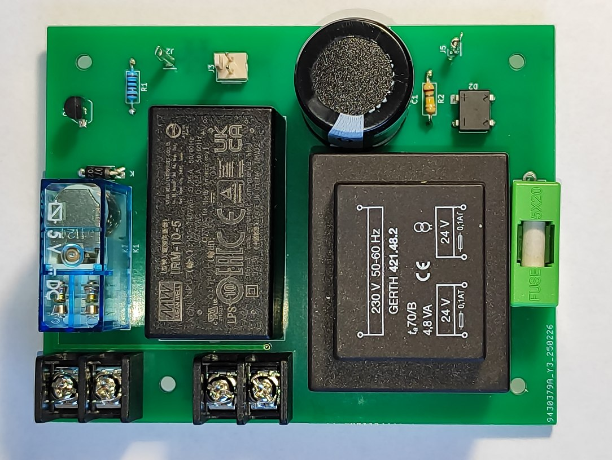

## Platine für piTelex TW39 (Stromversorgung)

Die hier beschriebene Platine liefert zum einen eine galvanisch vom Netz getrennte Linienstromversorgung mit ca 90V Leerlaufspannung und etwa 75V bei 40mA Last. Der Trafo ist für einen maximalen Sekundärstrom von 100mA_eff ausgelegt und die Sekundärseite ist auch so abzusichern. Da der Linienstrom auf der TW39-Platine **geregelt** wird (auch bei Kurzschluss des Linienstromkreises), ist ein Ansprechen der Feinsicherung in der Praxis so gut wie ausgeschlossen, deshalb kann sie ohne Komforteinbuße im Geräteinneren verbaut werden.

Zum anderen stellt die Schaltung +5V bei max 2A für die Versorgung eines RPi Zero WH und die übrige Steuerelektronik bereit. Dafür ist ein fertiger Netzteilbaustein Meanwell IRM 10-5 verwendet. 

Darüber hinaus gibt es einen relaisgeschalteten 230V-Ausgang zum Anschluss des Fernschreibers/des Fernschaltgeräts. Wird der Steuereingang "RP" mit dem entsprechenden Ausgang auf der TW39-Platine verbunden, kann damit eine Stromsparschaltung realisiert werden, so dass das Fernschreibequipment nur Netzspannung erhält für die Dauer eines ankommenden Fernschreibens und bei manueller Betätigung des Tasters "PT" (siehe TW39-Platine).

Das Platinenlayout ist auf Einfachheit hin getrimmt. Man kann sie zweilagig herstellen, aber auch als einlagig kupferkaschierte Platine ausführen, dann muss lediglich eine Drahtbrücke eingesetzt werden, die ansonsten durch die zweite Kupferlage realisiert wird. Die Leitungsführung ist in Standradrastermaß von 1/10 Zoll gehalten, so dass das Layout unverändert auch auf einer handelsüblichen Punktrasterplatine ganz "zu Fuß" umgesetzt werden kann.

 Besonderes Augenmerk habe ich auf ausreichende Leiterbahnabstände im Hochspannnungsbereich gelegt. 
Wenn man die Schaltung auf einer Punktrasterplatine aufbaut, müssen die nicht verwendeten Lötstützpunkte im Bereich der Netzspannung und der Linienstromversorgung weggefräst werden, denn die 0,4mm "Luft" 
zwischen zwei Lötstützpunkten sind bei diesen Spanungen sicher nicht ausreichend. 

Die Eingangsseite sollte mit 1A träge abgesichert werden. Das ist ausreichend für den Betrieb eines Fernschreibers und des Vorschaltgeräts. Diese Sicherung ist nicht auf der Platine vorgesehen, sondern wird bei mir über eine im Gehäuse verbaute Kaltgeräte-Einbaubuchse mit integriertem Sicherungshalter realisiert. Außerdem empfiehlt es sich, vor diese Netzteilschaltung ein Fehlerstromschutzorgan mit max 30mA Abschaltstrom einzusetzen (sofern nicht bauseitig bereits vorhanden), um Schäden duch mögliche Isolationsprobleme insbesondere bei älteren Maschinen abfangen zu können. Dazu ist eine dreiadrige Netzzuleitung mit Schutzleiter (PE) erforderlich, der auf die Ausgangs-Schukosteckdose für den Fernschreiber durchzuverbinden ist.
### Stückliste

|Bez.|Bauteil|Bemerkung|
|----|-------|---------|
| J1,J4| Schraubklemme 2pol  RM 10,16|
| J3|PinHeader 2pol RM2,54mm|
| J2,J5|PinHeader 1pol|
|T1| Trafo 230V / 2x24V 100mA |z.B. GERTH 421.48.2| 
|D1| 1N4007|
|D2|BrGleichrichter DF08M| o.ä.|
|F1|Sicherungshalter 5x20mm|
|K1|Relais DPDT 250V/8A, 5V Spule | z.B. FINDER-40.52|
|R1|1k 0,125W|
|R2|180k 0,25W|
|C1| 330 µF 200V|
|U1|BC337|
|PS1| MeanWell IRM 10-5|

## Abschließend der unvermeidliche Disclaimer:
Auch wenn dieser Schaltungsvorschlag in mehreren Exemplaren seit Jahren unproblematisch funktioniert: für korrekte Funktion und für mögliche Schäden, verursacht durch Verwendung der in diesem Repository bereitgestellten Informationen, kann ich keine Haftung übernehmen. 

Für die Einhaltung der sicherheitstechnischen Vorschriften und anerkannten Regeln der Technik, insbesondere im Bereich der elektrischen Sicherheit, ist jeder Anwender selbst verantwortlich.

Unabhängig davon würde ich mich über Rückmeldungen zu Funktion oder möglichen Verbesserungen sehr freuen.
