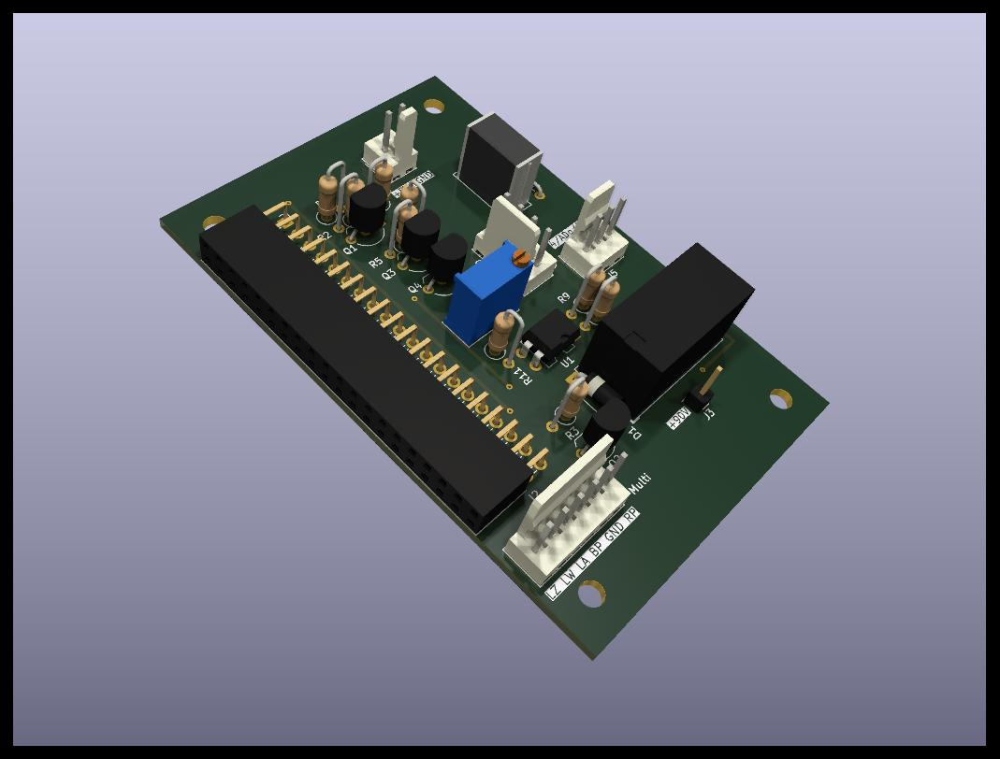
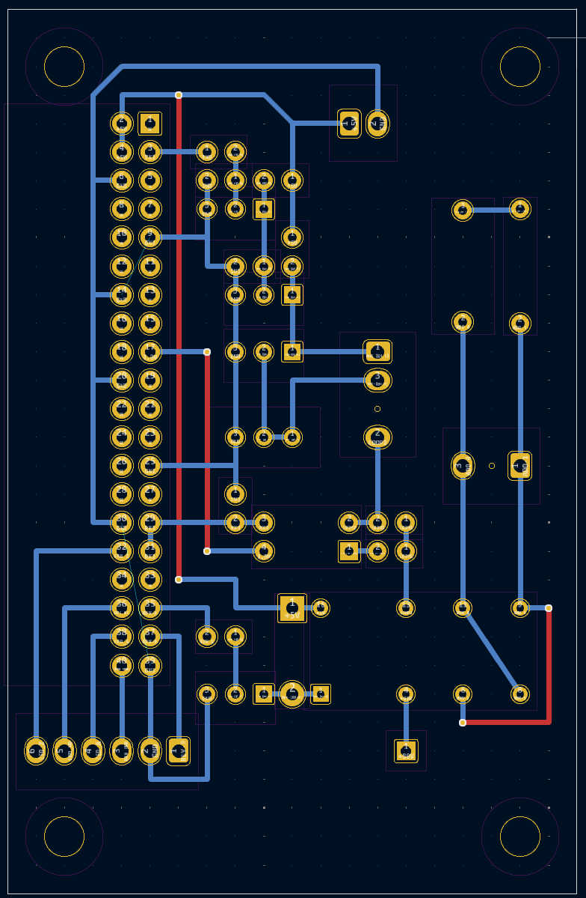
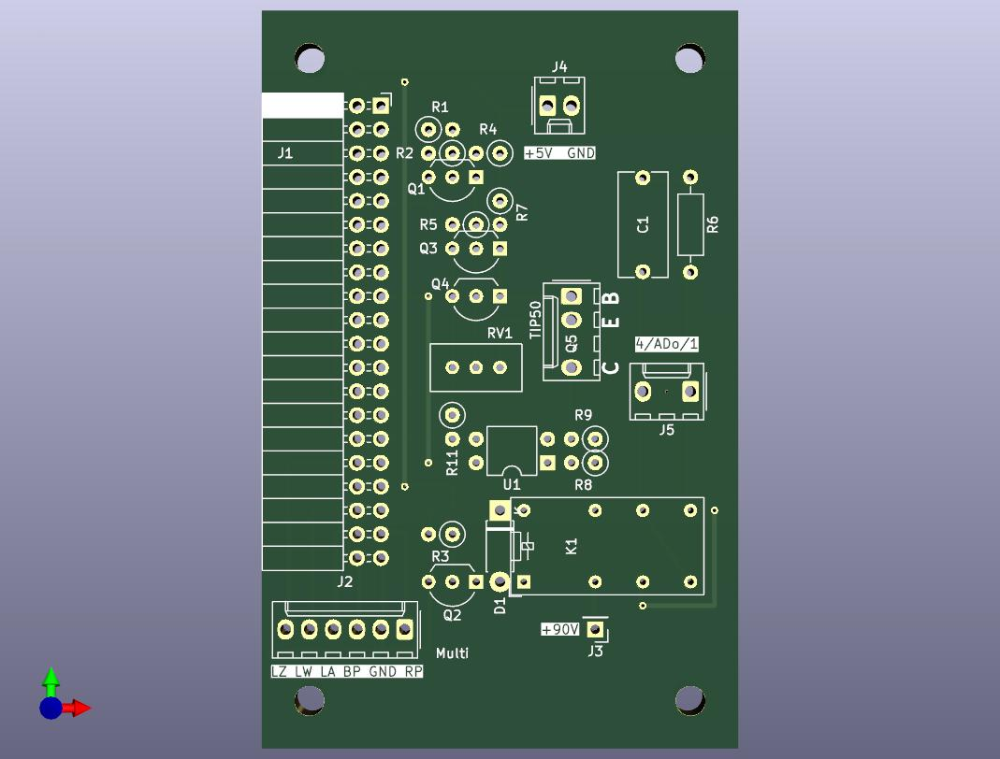
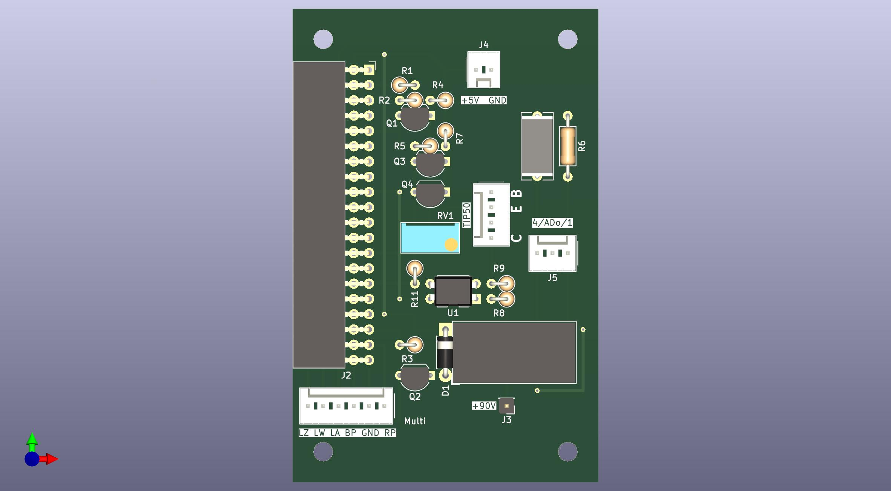

## Platine für piTelex TW39




Vor ein paar Jahren habe ich i-telex (www.itelex.net) entdeckt, weil ich einen alten Fernschreiber wieder zum Laufen bekommen wollte. Dazu erschien mir piTelex geeignet, weil es kostengünstig ist. 
Die hier beschriebene Platine habe ich dann aus den im [piTelex wiki](https://github.com/fablab-wue/piTelex/wiki) gezeigten Grundschaltungen entwickelt, weil ich mit der unter https://github.com/fablab-wue/piTelex.supplement angebotenen Eagle-Platine nicht wirklich klarkam (was aber wohl an mir liegt, die Platine ist ja verbreitet im Einsatz).

**Diese Platine eignet sich zum Anschluss eines Fernschreibers mit vorgeschaltetem Fernschaltgerät, das das Wählverfahren TW39 unterstützt.**
Die nötige Stromversorgung muss extern bereitgestellt werden.

Die Schaltung verwendet statt der ULN...-Treiber-ICs einfache NPN-Transistoren. Sie funktioniert in sechs meiner sieben piTelex-Stationen seit Jahren problemlos (Die siebte Station ist eine piTelex V.10 Station, die eine FS220 ohne FAG200 ins i-telex Netz bringt).


  



---
Die Platine ist nicht auf Kompaktheit optimiert; das Layout ist auf Einfachheit getrimmt. Die Leitungsführung ist bewusst in Standardrastermaß von 1/10 Zoll gehalten, so dass das Layout unverändert auch auf einer handelsüblichen Punktrasterplatine ganz "zu Fuß" umgesetzt werden kann.
Man kann sie zweilagig herstellen, aber auch als einlagig kupferkaschierte Platine ausführen, dann müssen lediglich drei Drahtbrücken eingesetzt werden, die ansonsten durch die zweite Kupferlage realisiert werden.  
Besonderes Augenmerk habe ich auf ausreichende Leiterbahnabstände im Hochspannnungsbereich gelegt. Wenn man die Schaltung auf einer Punktrasterplatine aufbaut, müssen die nicht verwendeten Lötstützpunkte im Bereich der Linienstromversorgung weggefräst werden, denn die 0,4mm "Luft" zwischen zwei Lötstützpunkten sind bei 120V Speisespannung sicher nicht ausreichend.

### Anschlüsse

Die Platine bietet folgende Anschlussmöglichkeiten:

|Stecker|Pin|Name|Ein-/Ausgang|Beschreibung|
|-------|---|----|------------|---------------------------|
|J3     |1  |+90V|E           |Linienspannungseingang (+) |
|||||
|J4     |1  |+5V |E           |+5V Versorgungsspannung    |
|J4     |2  |GND |E           | Massepotential für +5V und +90V|
|||||
|J5     |1  |    |A           |Linienstrom für TW39 (+) (ADo8 Pin 1)|
|J5     |2  |    |A           |Linienstrom für TW39 (-) (ADo8 Pin 4)|
|||||
J2     |1   |RP  |A           |`pin_power` herausgeführt. Steuert das Leistungsrelais für die Netzspannungsversorgung zum den Fernschreiber manuell bei Drücken der Powertaste und bei ankommenden Verbindungen. Das Relais befindet sich auf der Stromversorgungsplatine.|
J2     |2   |GND |A           |Massepotential für LED und Taster|
J2     |3   |BP  |E           |`pin_button_PT` herausgeführt. Taster (gegen GND) schaltet den Fernschreiber über das Leistungsrelais ein und aus.|
J2     |4   |LA  |A           |`pin_LED_A` herausgeführt. Hier kann eine LED mit passendem Vorwiderstand gegen GND angeschlossen werden.|
J2     |5   |LW  |A           |`pin_LED_WB` herausgeführt. Hier kann eine LED mit passendem Vorwiderstand gegen GND angeschlossen werden.|
J2     |6   |LZ  |A           |`pin_LED_Z` herausgeführt. Hier kann eine LED mit passendem Vorwiderstand gegen GND angeschlossen werden.|

Die Pins können auch mit anderen Funktionen belegt werden. Dazu ist dann die `telex.json` entsprechend anzupassen.

### telex.json

Die Schaltung verwendet **nicht** die Standard-GPIOs von piTelex, daher füge ich eine passende `telex.json` Datei mit den korrekten GPIO-Nummern bei:

```JSON
      "RPiTTY": {
      "type": "RPiTTY",         # standard TW39 (current loop) CCU and teletype
      "enable": true,
      "mode": "TW39",
      "pin_txd": 2,
      "pin_rxd": 5,
      "pin_relay": 13,          # GPIO of loop relay (for changing polarity)
      "pin_number_switch": -1,  # -1 = use definition in "RPiCtrl"
      "txd_powersave": true     # switch off loop current in sleep mode
    },
    "RPiCtrl": {
      "type": "RPiCtrl",
      "enable": true,
      "pin_number_switch": 6,   # GPIO of pin to monitor for dial pulses
      "pin_button_PT": 21,      # GPIO for power button
      "pin_LED_WB": 16,         # GPIO for LED indicating dial mode (Wählbereitschaft)
      "pin_LED_A": 20,          # GPIO for LED indicating active connection
      "pin_LED_Z": 12,          # GPIO for LED indicating Standby/Sleep
      "LED_Z_heartbeat": 2,     # duty cycle of hearbeat in ZZ mode: 0.5s on / 1s off
      "pin_power": 26,          # GPIO for power relay (switching mains)
      "inv_power": false
    },
(...)
# if you want to use the power saving functionality:
  "power_off_delay": 3,         # wait 3 seconds after poweroff condition 
                                # before switching off mains
#
  "power_button_timeout": 7200, # if switched on by power button,
                                # switch off mains after 2 hours of inactivity 
                                # (probably forgot to switch off manually...)
```
### Bauteileliste

Bauteil|Wert|
|-|-|
C1|100n Umax >= 250V|
D1|1N4007|
J1|PinSocket_2x20_P2.54mm_Horizontal|
J2-J5|PinHeader,z.B. Molex_KK-254 o.ä.|
K1|Relais DPDT, z.B. Axicom D2n,Relais_Omron_G5V-2 oder Axicom D2n o.ä|
Q4,Q3,Q2,Q1|BC337|
Q5|TIP50|
R11,R3,R1|1kOhm|
R2|470Ohm|
R4|510Ohm|
R6|100Ohm|
R7,R5|330Ohm|
R8,R9|68Ohm|
RV1|20Ohm Mehrgang|
U1|LTV-817 o.ä.|

Alle Widerstände 0,125 W oder 0,25W

## Abschließend der unvermeidliche Disclaimer:
Auch wenn dieser Schaltungsvorschlag in mehreren Exemplaren seit Jahren unproblematisch funktioniert: für korrekte Funktion und für mögliche Schäden, verursacht durch Verwendung der in diesem Repository bereitgestellten Informationen, kann ich keine Haftung übernehmen. 

Für die Einhaltung der sicherheitstechnischen Vorschriften und anerkannten Regeln der Technik, insbesondere im Bereich der elektrischen Sicherheit, ist jeder Anwender selbst verantwortlich.

Unabhängig davon würde ich mich über Rückmeldungen zu Funktion oder möglichen Verbesserungen sehr freuen.
