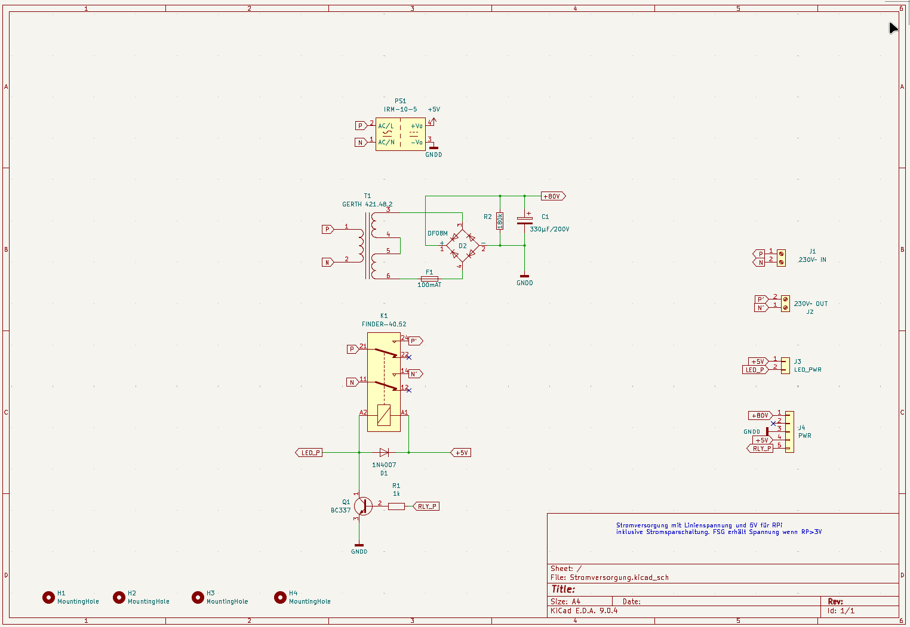

## Stromversorgung für piTelex TW39 (Version 2)

## Die Funktion
Die hier beschriebene Platine liefert zum einen eine galvanisch vom Netz getrennte Linienstromversorgung mit ca 90V Leerlaufspannung und etwa 75V bei 40mA Last. Zum anderen stellt sie ebenfalls galvanisch vom Netz getrennte +5V bei max 2A für die Versorgung eines RPi Zero WH und die übrige Steuerelektronik bereit. Dafür ist ein fertiger Netzteilbaustein Meanwell IRM 10-5 verwendet. Dieser Baustein ist in Schutzklasse II ausgeführt und u.a. TÜV-zertifiziert:

Beide Sekundärspannungen haben ein gemeinsames Potential. 

Darüber hinaus gibt es einen relaisgeschalteten 230V-Ausgang zum Anschluss des Fernschreibers/des Fernschaltgeräts. Wird der Steuereingang "RP" mit dem entsprechenden Ausgang auf der TW39-Platine verbunden, kann damit eine Stromsparschaltung realisiert werden, so dass das Fernschreibequipment nur Netzspannung erhält für die Dauer eines ankommenden Fernschreibens und bei manueller Betätigung des Tasters "PT" ([siehe TW39-Platine](https://github.com/rwobrecht/piTelex-contrib/tree/main/TW39/V2/TW39-mit-Powersave) ). Der Schaltzustand kann über eine LED angezeigt werden.

---

## Die Platine

Das Platinenlayout ist auf Einfachheit hin getrimmt. Besonderes Augenmerk habe ich auf ausreichende Leiterbahnabstände im Hochspannnungsbereich gelegt. Gegenüber der Version 1 wurden die Positionierung der Schraubklemmenblöcke optimiert und mit J3 der Anschluss einer mit 5V betreibbaren LED zur Anzeige des Relaisschaltzustands ermöglicht. Außerdem wurden die Steckverbinder neu organisiert.

### Die Stückliste

|Bez.|Bauteil|Funktion||
|----|-------|---------|----|
| J1 | Schraubklemme 2pol  RM 7,5mm |Netzspannungszuführung||
| J2 | Schraubklemme 2pol  RM 7,5mm |relaisgeschalteter Netzausgang zum Anschluss des FSG||
| J3|PinHeader 2pol RM2,54mm|Anschluss einer 5V-LED (Relaiszustandsanzeige), Pin1:Anode||
| J4 |PinHeader 5pol|Versorgung der TW39-Platine und Relaiseingang: Pin1: +80V Linie Pin2: leer Pin3: GND Pin4: +5V Pin5: RP (Steuereingang des Relais)|z.B. Molex KK254 o.ä.|
|T1| Trafo 230V / 2x24V 100mA |Erzeugen der Linienspannung|z.B. GERTH 421.48.2|
|D1| 1N4007|||
|D2|BrGleichrichter DF08M| o.ä.| |
|F1|Sicherungshalter 5x20mm|Absicherung des Linienstromkreises||
|K1|Relais DPDT 250V/8A, 5V Spule |  | z.B. FINDER-40.52 |
|R1|1k 0,125W|||
|R2|180k 0,25W|||
|C1| 330 µF 200V|||
|Q1|BC337|||
|PS1| MeanWell IRM 10-5|||

---

## Die Sicherheit

Es ist eine **drei**adrige Netzzuleitung **mit Schutzleiter (PE)** zu verwenden, der auf die Ausgangs-Schukosteckdose für den Fernschreiber durchzuverbinden ist.
Die Eingangsseite (230V) sollte mit 1A träge abgesichert werden. Das ist ausreichend für den Betrieb eines Fernschreibers und des Vorschaltgeräts. Diese Sicherung ist nicht auf der Platine vorgesehen, sondern muss extern z.B. über eine im Gehäuse verbaute Kaltgeräte-Einbaubuchse mit integriertem Sicherungshalter realisiert werden. Außerdem empfiehlt es sich, vor diese Netzteilschaltung ein Fehlerstromschutzorgan mit max 30mA Abschaltstrom (Personenschutzschalter) einzusetzen (sofern nicht bauseitig bereits vorhanden), um Schäden duch mögliche Isolationsprobleme insbesondere bei älteren Maschinen abfangen zu können. 

Der Trafo ist sekundärseitig mit 100mAT abzusichern, der Sicherungshalter ist auf der Platine vorgesehen. Da der Linienstrom auf der TW39-Platine **geregelt** wird (auch bei Kurzschluss des Linienstromkreises), ist ein Ansprechen der Feinsicherung in der Praxis so gut wie ausgeschlossen, deshalb ist sie ohne Komforteinbuße auf der Platine im Geräteinneren verbaut.

Das Ganze wird sinnvollerweise in ein Vollkunststoffgehäuse Schutzklasse II eingebaut. Von außen berührbare Metallteile (bspw. Metallfrontplatte o.ä) mit ausreichendem Leiterquerschnitt schutzerden!

---

## Abschließend der unvermeidliche Disclaimer:

Auch wenn dieser Schaltungsvorschlag in mehreren Exemplaren seit Jahren unproblematisch funktioniert: für korrekte Funktion und für mögliche Schäden, verursacht durch Verwendung der in diesem Repository bereitgestellten Informationen, kann ich keine Haftung übernehmen. 

Für die Einhaltung der sicherheitstechnischen Vorschriften und anerkannten Regeln der Technik, insbesondere im Bereich der elektrischen Sicherheit, ist jeder Anwender selbst verantwortlich.

Unabhängig davon würde ich mich über Rückmeldungen zu Funktion oder möglichen Verbesserungen sehr freuen.
