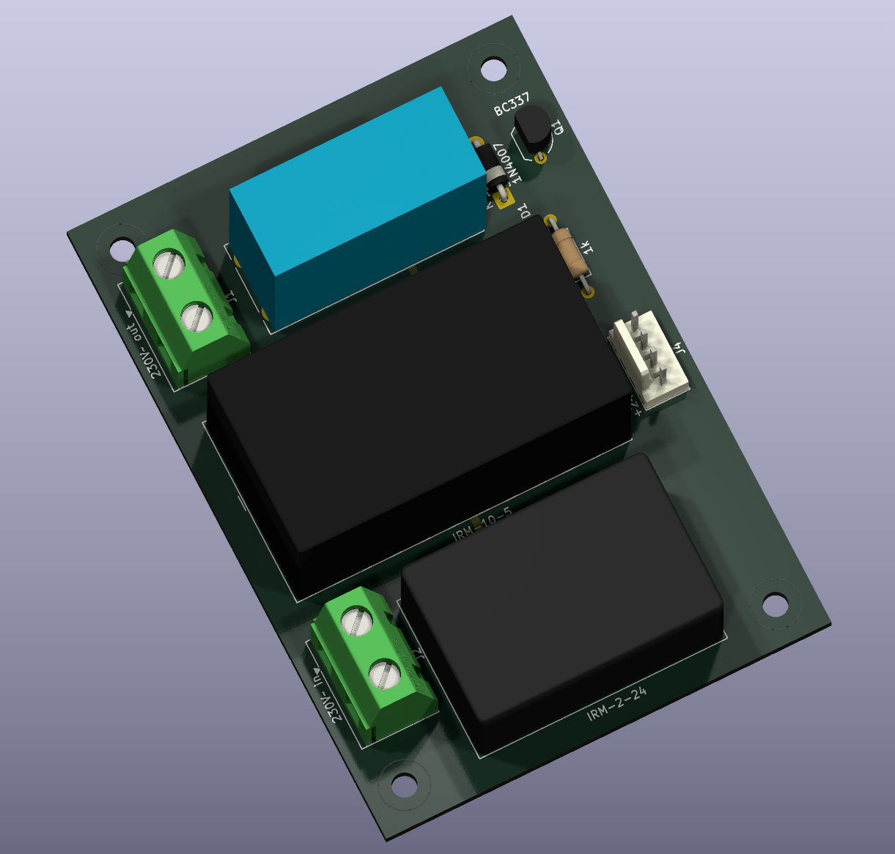
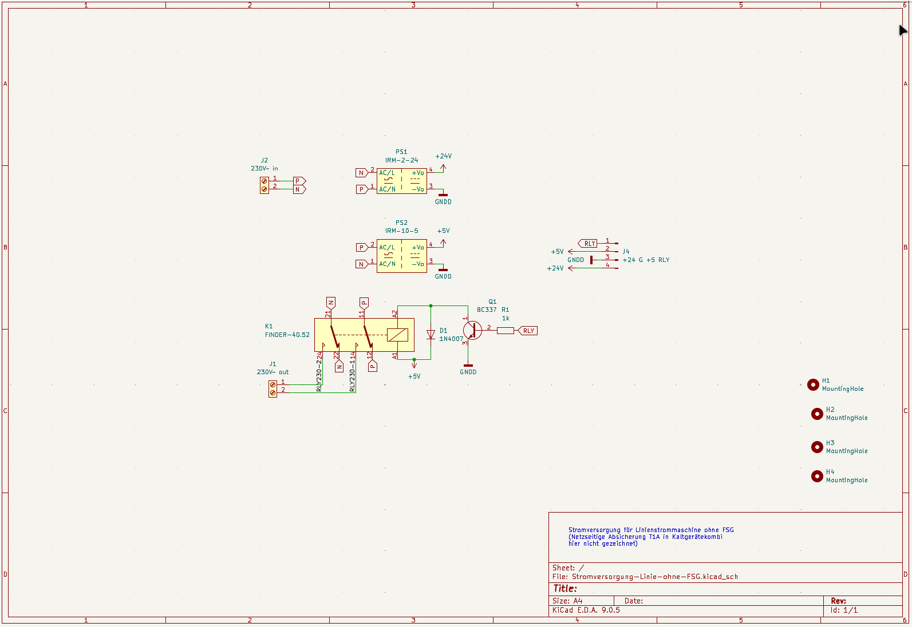
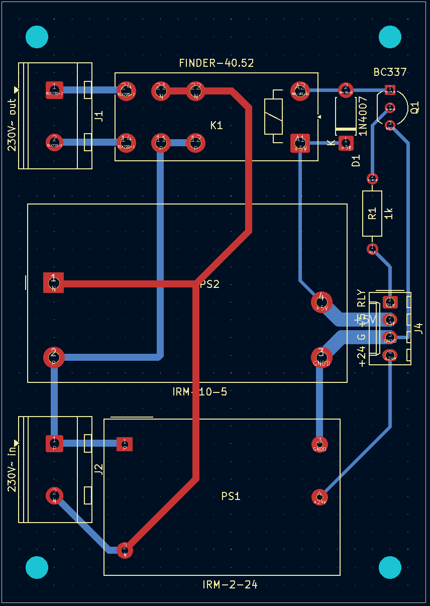

## Stromversorgung für piTelex TW39 (ohne FSG)

## Die Funktion
Die hier beschriebene Platine liefert zum einen eine galvanisch vom Netz getrennte Linienstromversorgung mit 24V Spannung mit einem fertigen Netzteilbaustein Meanwell IRM-2-24. Zum anderen stellt sie ebenfalls galvanisch vom Netz getrennte +5V bei max 2A für die Versorgung eines RPi Zero WH und die übrige Steuerelektronik bereit. Dafür ist ein fertiger Netzteilbaustein Meanwell IRM 10-5 verwendet. Diese Bausteine sind in Schutzklasse II ausgeführt und u.a. TÜV-zertifiziert:

Beide Sekundärspannungen haben ein gemeinsames Potential. 

Darüber hinaus gibt es einen relaisgeschalteten 230V-Ausgang zum Anschluss des Fernschreibers/des Fernschaltgeräts. Der Steuereingang "RLY" wird mit dem entsprechenden Ausgang auf der TW39-Platine verbunden, so dass der Fernschreiber Netzspannung erhält für die Dauer eines ankommenden Fernschreibens, bei Betätigung der "AT"-Taste (sofort bei Tastaturwahl, bei Nummernschalterwahl erst nach Verbindungsaufbau) und bei Betätigung des Tasters "LT" ([siehe TW39-Platine](https://github.com/rwobrecht/piTelex-contrib/tree/main/TW39/Ohne-FSG/TW39-ohne-FSG-mit-Powersave) ).

---

## Die Platine

### Die Stückliste

|Bez.|Bauteil|Funktion||
|----|-------|---------|----|
| J1 | Schraubklemme 2pol  RM 7,5 |relaisgeschalteter Netzausgang zum Anschluss des FS||
| J2 | Schraubklemme 2pol  RM 7,5 |Netzspannungszuführung||
| J4 |PinHeader 4pol|Versorgung der TW39-Platine und Relaiseingang: Pin1: RLY Steuereingang Pin2: +5V Pin3: GND Pin4: +24V|z.B. Molex KK254 o.ä.|
|D1| 1N4007|||
|K1|Relais DPDT 250V/8A, 5V Spule |  | z.B. FINDER-40.52 |
|R1|1k 0,125W|||
|Q1|BC337|||
|PS1|Meanwell IRM-2-24|||
|PS2| MeanWell IRM-10-5 |||

---

## Die Sicherheit

Es ist eine **drei**adrige Netzzuleitung **mit Schutzleiter (PE)** zu verwenden, der auf die Ausgangs-Schukosteckdose für den Fernschreiber durchzuverbinden ist.
Die Eingangsseite (230V) sollte mit 1A träge abgesichert werden. Das ist ausreichend für den Betrieb eines Fernschreibers. Diese Sicherung ist nicht auf der Platine vorgesehen, sondern muss extern z.B. über eine im Gehäuse verbaute Kaltgeräte-Einbaubuchse mit integriertem Sicherungshalter realisiert werden. Außerdem empfiehlt es sich, vor diese Netzteilschaltung ein Fehlerstromschutzorgan mit max 30mA Abschaltstrom (Personenschutzschalter) einzusetzen (sofern nicht bauseitig bereits vorhanden), um Schäden durch mögliche Isolationsprobleme insbesondere bei älteren Maschinen abfangen zu können. 

Das Ganze wird sinnvollerweise in ein Vollkunststoffgehäuse Schutzklasse II eingebaut. Von außen berührbare Metallteile (bspw. Metallfrontplatte o.ä) mit ausreichendem Leiterquerschnitt schutzerden!

---

## Abschließend der unvermeidliche Disclaimer:

Auch wenn dieser Schaltungsvorschlag in mehreren Exemplaren seit Jahren unproblematisch funktioniert: für korrekte Funktion und für mögliche Schäden, verursacht durch Verwendung der in diesem Repository bereitgestellten Informationen, kann ich keine Haftung übernehmen. 

Für die Einhaltung der sicherheitstechnischen Vorschriften und anerkannten Regeln der Technik, insbesondere im Bereich der elektrischen Sicherheit, ist jeder Anwender selbst verantwortlich.

Unabhängig davon würde ich mich über Rückmeldungen zu Funktion oder möglichen Verbesserungen sehr freuen.1
