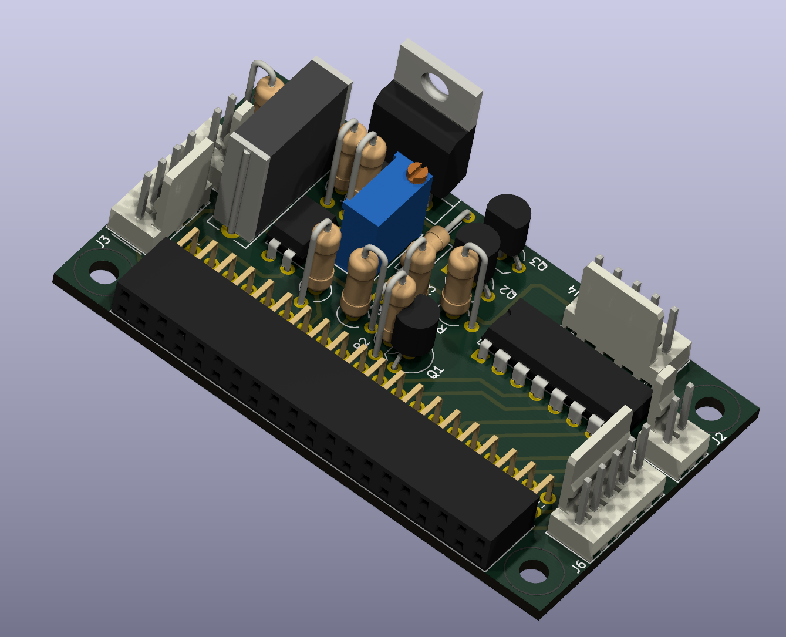

# Platine für piTelex TW39 (ersetzt Fernschaltgerät)



## Die Funktionsmerkmale
Die hier beschriebene Platine eignet sich zum Anschluss eines 40mA-Linienstrom-Fernschreibers (z.B. T100, Lo15 u.a.) an das i-telex-Netz für das Wählverfahren TW39 mit Nummernschalterwahl oder Tastaturwahl, ***ohne*** vorgeschaltetes Fernschaltgerät. piTelex übernimmt die Funktion des FSG.

Da kein FSG gespeist werden muss, kann die Linienspannung ohne Einbuße auf 24V herabgesetzt werden; die Verlustwärme im Leistungstransistor wird dadurch deutlich reduziert.

Die nötige Stromversorgung (5V= und 24V= für die Linienversorgung)  muss extern bereitgestellt werden. Ein passender Bauvorschlag findet sich im [entsprechenden Unterverzeichnis](../Stromversorgung-für-TW39-ohne-FSG-mit-Powersave) des Repositories. Dieser unterstützt auch den erforderlichen Schaltausgang für die Netzspannungsversorgung des Fernschreibers (normalerweise würde das FSG diese Funktion übernehmen). 


#### Tasten 

Da die Funktion eines FSG nachgebildet wird, werden drei Tasten benötigt:

* Anruftaste
* Schlusstaste
* Lokaltaste

Zusätzlich ist eine Taste "ID" vorgesehen, um bei Maschinen ohne Kennungsgeber den Software-KG auszulösen. Sie kann bei Bedarf auch weggelassen oder anders verwendet werden, dazu muss dann deren Funktion in der `telex.json` angepasst werden.


#### LEDs

Die Platine/Schaltung verwendet vier LEDs:

* LED_Z blinkt bei Standby der Software ("ZZ"-Zustand) und leuchtet kontinuierlich bei Betriebsbereitschaft ("Z"-Zustand). Der Blinkrhythmus kann in `telex.json` mit `LED_Z_heartbeat` eingestellt werden (s.u.).
* LED_WB leuchtet bei Wählbereitschaft
* LED_A leuchtet bei bestehender i-telex-Verbindung und bei Lokalbetrieb
* LED_LT leuchtet bei Lokalbetrieb

Für alle vier LEDs sind 24V-Ausgänge vorhanden, mit denen handelsübliche 24V-Leuchtdrucktaster angesteuert werden können. So können die LEDs in die Taster integriert werden mit der Zuordnung

* AT-Taste: LED_WB
* LT-Taste: LED_LT
* ST-Taste: LED_A
* ID-Taste: LED_Z (das kann natürlich auch anders gelöst werden...)


#### Netzversorgung des Fernschreibers

Der Pin `RLY`  dieser Platine wird mit dem entsprechenden Pin der Stromversorgungsplatine verbunden und steuert das Leistungsrelais auf der Stromversorgungsplatine, an deren Kontaktblock die (schutzgeerdete!) Steckdose zur Versorgung des Fernschreibers angeklemmt wird. 

* Bei ankommendem Anruf schaltet piTelex die Stromversorgung für den Fernschreiber ein und nach Verbindungsende automatisch auch wieder aus.
* Für einen ausgehenden Anruf drückt man kurz die am `pin_button_AT` angeschlossene Anruftaste, um das Stromrelais einzuschalten (bei Tastaturwahl, ansonsten erst bei aufgebauter Verbindung). Nach Verbindungsende wird die Anlage durch Drücken der am `pin_button_ST` angeschlossenen "ST"-Taste oder automatisch nach einer vorwählbaren Zeit (`power_button_timeout`) wieder ausgeschaltet.
* Zusätzlich kann durch Aktivieren von `txd_powersave` im Standby auch der Schleifenstrom abgeschaltet werden. 

Der Lokalbetrieb wird durch Drücken der am `pin_button_LT` angeschlossenen Lokaltaste ein- und durch Drücken der "ST"-Taste wieder ausgeschaltet.

----


## Die Schaltung


Die Empfängerschaltung ist unverändert aus dem piTelex-Wiki übernommen, die Schaltung des Senders besteht wie im Original aus einer Stromquellenschaltung mit BC337 und TIP50, verwendet aber statt der ULN...-Treiber-ICs für die Invertierung und Ankopplung des TXD-Signals zwei einfache NPN-Transistoren BC337. Mit dem Trimmpoti wird der Schleifenstrom auf 40mA eingestellt. Da wir es hier mit einer einstellbaren Konstantstromquelle zu tun haben, ist die Stromschleife kurzschlussfest und die Einstellung der 40mA kann daher auch bei Kurzschluss der Schleife erfolgen. Die 24V-Ausgänge für die LEDs werden über einen ULN2003A bereitgestellt. 

Die Gesamtstromaufnahme von Fernschreiber (40mA) plus maximal zwei gleichzeitig leuchtenden LEDs ("LT" und "A") darf bei Verwendung des Netzteil-Bauvorschlags mit IRM-2-24-Wandler 80 mA nicht überschreiten.


---

## Die Platine


Als SBC ist ein Raspberry Pi Zero WH vorgesehen, der einfach seitlich auf die zweireihige Kontaktleiste gesteckt wird. Es passen natürlich auch andere RPi mit 40-poligem GPIO-Sockel.
Für die Steuerung eines einzelnen TW39-Fernschreibers ist ein  RPi Zero jedenfalls mehr als ausreichend.

Der Leistungstransistor TIP50 muss ausreichend gekühlt werden. Der Kühlkörper sollte etwa 4W abgeben können bei zulässiger Temperaturerhöhung. 

Der Linienstrom von 40mA wird mit RV1 eingestellt, z.B. bei kurzgeschlossenen Pins von J5


### Bauteileliste

| Bauteil  | Bezeichnung                       | Bemerkung                       |
| -------- | --------------------------------- | ------------------------------- |
| C1       | 100nF/100V, RM15, MKT             |                                 |
| J1       | PinSocket_2x20_P2.54mm Horizontal |                                 |
| J2,J5    | PinHeader 1x02 P2.54mm Vertical   | z.B. Molex KK-254               |
| J3       | PinHeader 1x04 P2.54mm Vertical   | z.B. Molex KK-254               |
| J4,J6    | PinHeader 1x05 P2.54mm Vertical   | z.B. Molex KK-254               |
| Q1,Q2,Q3 | BC337                             |                                 |
| Q4       | TIP50                             |                                 |
| R1,R9    | 1kOhm                             | 0,25W                           |
| R2       | 470 Ohm                           | 0,25W                           |
| R3       | 510 Ohm                           | 0,25W                           |
| R4,R7    | 330 Ohm                           | 0,25W                           |
| R6,R5    | 68 Ohm                            | 0,25W                           |
| R8       | 100 Ohm                           | 0,25W                           |
| RV1      | 20 Ohm Mehrgang                   | 0,5W z.B. Bourns_3296W_Vertical |
| U1       | LTV-817                           |                                 |
| U2       | ULN2003A                          |                                 |


### Anschlüsse

Die Platine bietet folgende Anschlussmöglichkeiten:

|Stecker|Pin|Name|Ein-/Ausgang|Beschreibung|
|-------|---|----|------------|---------------------------|
|**J1**<br>(RPi)|*|*|*|RaspBerryPi (ZeroW, Zero2W,...)|
||||||
|**J2**<br>(NrS)|1|NSI|E|Nummernschalter (nicht bei Tastaturwahl)|
||2|GND|E|Nummernschalter (nicht bei Tastaturwahl)|
|     |      |          |              ||
| **J3**<br>(PWR)     | 1    | RLY      | A            | Schaltet das Leistungsrelais für die Netzspannungsversorgung zum Fernschreiber<br>manuell beim Drücken der Anruftaste und bei ankommenden Verbindungen. <br/>Das Relais befindet sich auf der Stromversorgungsplatine. Verbinde zu Pin 1 des Steckers auf der Stromversorgungsplatine. |
|                     | 2    | +5V      | E            | +5V Versorgungsspannung                                      |
|                     | 3    | GND      | E            | Massepotential für +5V und +24V                              |
|                     | 4    | +24V     | E            | Linienspannungseingang (+)                                   |
|                     |      |          |              |                                                              |
| **J4**<br>(LEDs)   | 1    | +24V     | A            | Gemeinsame 24V-Versorgung für die LED-Anoden                 |
|                     | 2    | 24LED_LT | E            | Kathode der LED_LT, Leuchtet bei Lokalbetrieb                |
|                     | 3    | 24LED_A  | E            | Kathode der LED_A, Leuchtet bei Lokalbetrieb und bei bestehender Verbindung |
|                     | 4    | 24LED_WB | E            | Kathode der LED_WB, Leuchtet bei Wählbereitschaft            |
|                     | 5    | 24LED_Z  | E            | Kathode der LED_Z. Leuchtet bei Systembereitschaft, blinkt langsam im Standby (einstellbar mit `LED_Z_heartbeat` in der `telex.json` ) |
| **J5**<br>(ADo)     | 1    | +24V     | A            | Linienstromausgang (zu Pin 1 der ADo-8) (Pin 2 und Pin 3 brücken!) |
|                     | 2    | ADo-4    | E            | Linienstromeingang (von Pin 4 der ADo-8)                     |
|                     |      |          |              |                                                              |
| **J6**<br> (Buttons) | 1    | GND      | E            | gemeinsamer Rückleiter der Taster                            |
|                     | 2    | BTN_LT   | A            | Lokaltaste (`pin_button_LT` herausgeführt)                   |
|                     | 3    | BTN_AT   | A            | Lokaltaste (`pin_button_AT` herausgeführt)                   |
|                     | 4    | BTN_ST   | A            | Lokaltaste (`pin_button_ST` herausgeführt)                   |
|                     | 5    | BTN_ID   | A            | Lokaltaste (`pin_button_ID` herausgeführt)                   |


---


## Die `telex.json`

Die Schaltung verwendet **nicht** die Standard-GPIOs von piTelex, daher füge ich einen passenden Ausschnitt aus der `telex.json` Datei mit den korrekten GPIO-Nummern bei. Diese gelten für Nummernschalterwahl. Für Tastaturwahl nötige Änderungen sind entsprechend aufgeführt.

```JSON
{
  "devices": {
    "screen": {
      "type": "screen",
      "enable": true
    },
    "RPiTTY": {
      "type": "RPiTTY",
      "enable": true,
      "mode": "TW39"  	             # mode = "TWM" für Tastaturwahl
      "pin_txd": 22,
      "txd_powersave": true,
      "pin_rxd": 27,
      "pin_relay": 14,               # Leistungsrelais (Signal RLY)
      "pin_number_switch": -1,       # -1: Verwende Definition in "RPiCtrl", 0 für Tastaturwahl
      "baudrate": 50,
      "loopback": true,
      "use_observe_line": true,
      "pin_observe_line": 17
    },
    "RPiCtrl": {
      "type": "RPiCtrl",
      "enable": true,
      "pin_number_switch": 13,        # 0 für Tastaturwahl
      "inv_number_switch": false,
      "pin_button_AT": 26,
      "pin_button_ST": 21,
      "pin_button_LT": 19,
      "pin_button_U3": 20,            # U3 standardmäßig vorbelegt mit "#" d.i. die eigene Kennung
      "pin_LED_A": 11,
      "pin_LED_WB": 5,
      "pin_LED_LT": 9,
      "pin_LED_Z": 6,
      "LED_Z_heartbeat": 3,           # Tastverhältnis off/on = 3:1
      "delay_AT": 1,                  # Gimmick: Zeitverzögerung in s simuliert Elektromechanik :-)
      "delay_ST": 1
    },
    "i-Telex": {
      "type": "i-Telex",
      "enable": true,
      "port": 2342,
      "tns_dynip_number": 0,
      "tns_pin": 12345
    }
  },
  "wru_id": "123456 dummy d",          # Software-Kennung
  "errorlog_path": "./piTelex-log/",
  "power_off_delay": 5,                # Verzögerung für das Abschalten der Netzspannung nach Drücken der ST-Taste   
  "power_button_timeout": 7200,        # Nach 7200s Inaktivität wird die Maschine abgeschaltet
  "wru_replace_always": true,          # Immer Software-KG nutzen (nur für Maschine ohne KG)
  "dial_timeout": 0,                   # Standard-Wahlverfahren
  "continue_with_no_printer": false    # Ohne funktionierenden Drucker keine Verbindung annehmen
}

```


## Abschließend der unvermeidliche Disclaimer:
Für korrekte Funktion und für mögliche Schäden, verursacht durch Verwendung der in diesem Repository bereitgestellten Informationen, kann ich keine Haftung übernehmen. 

Für die Einhaltung der sicherheitstechnischen Vorschriften und anerkannten Regeln der Technik, insbesondere im Bereich der elektrischen Sicherheit, ist jeder Anwender selbst verantwortlich.

Unabhängig davon würde ich mich über Rückmeldungen zu Funktion oder möglichen Verbesserungen, auch in der Dokumentation, sehr freuen.
