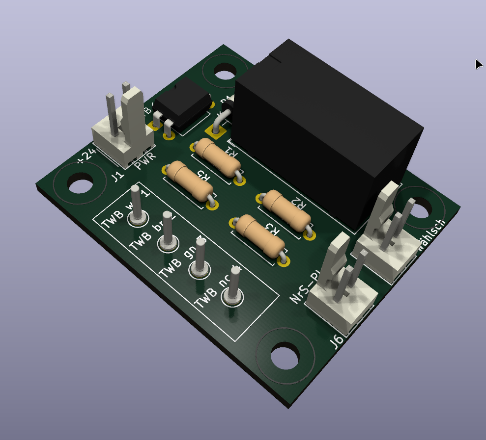
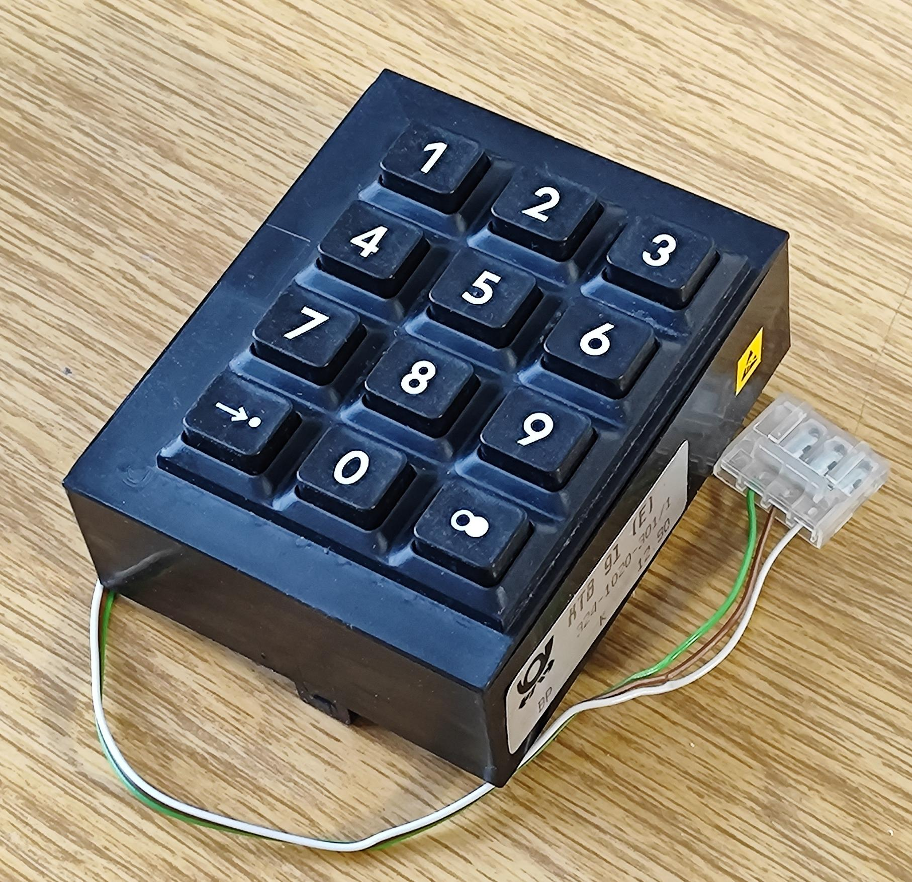
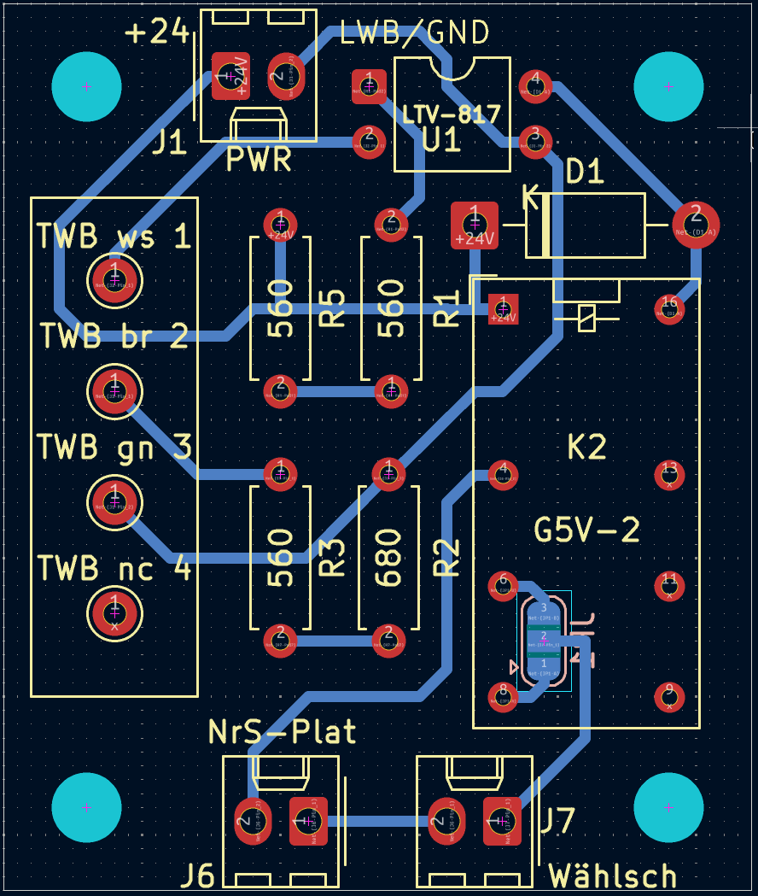

# Platine zum Anschluss eines Tastwahlblocks

 

## Die Funktionsmerkmale
piTelex kann softwaremäßig auf Tastaturwahl (TWM) oder Impulswahl (TW39) konfiguriert werden. 

Bei Impulswahl können die Wahlimpulse aus der RXD-Leitung abgeleitet werden (bspw. für den Nummernschalter im FSG) oder von einem eigenen GPIO-Pin gelesen werden (`"pin_number_switch"`). Bei Betrieb von piTelex als FSG-Ersatz bietet sich außer dem Anschluss von Steuertasten (AT,ST,LT) und passenden LEDs zur Statusanzeigen (LED_A, LED_WB, LED_Z, LED_LT) der Anschluss eines Nummernschalters zum "stilechten" Wählen an.

Die hier beschriebene Platine ermöglicht den Anschluss eines [Tastwahlblocks](https://de.wikipedia.org/wiki/Tastenwahlblock) für Impulswahl (z.B. TWB75 oder KTB91) anstelle eines Nummernschalters. 

## Die Schaltung

Die Platine ist für die Versorgung mit +24V ausgelegt und  in erster Linie zur Verwendung mit der [TW39-Platine ohne FSG](../Ohne-FSG/) gedacht. Bei anderen Versorgungsspannungen sind die Widerstände R1 und R5 so anzupassen, dass der TWB einen Strom von ca 10-20mA "zieht", dabei ist die nötige Belastbarkeit der Widerstände berücksichtigen.

Der TWB wird zwischen seinen Anschlüssen 1 und 3 mit einem Strom von 10-20mA gespeist. R2 und R3 ahmen die Leitungsnachbildung für den TWB nach. Über einen Optokoppler wird ein Relais angesteuert, das die Impulse  potentialfrei über einen Relaiskontakt erzeugt. In Reihe zum Relaiskontakt kann zusätzlich zum TWB auch noch ein NrS verwendet werden, ansonsten muss J7 gebrückt werden. Über J8 wird der Adapter mit dem `"pin_number_switch"` der piTelex-Platine verbunden.

Mit JP1 kann  gewählt werden, ob im Ruhezustand die Schleife offen oder geschlossen (=default) ist.

Pin 2 des J1 kann entweder auf GND des piTelex-Boards gelegt werden oder aber bei Verwendung der [TW39-Platine ohne FSG](../Ohne-FSG/) an die Kathode der LED_WB. Dann wird die gesamte Schaltung nur im Status "Wählbereit" mit Spannung versorgt.

---

## Die Platine

... ist nicht sehr komplex :-)

### Bauteileliste

| Bauteil   | Bezeichnung                     | Bemerkung         |
| --------- | ------------------------------- | ----------------- |
| R3,R5,R6  | 560Ohm 1/4W                     |                   |
| R2        | 680 Ohm 1/4W                    |                   |
| J1,J6, J7 | PinHeader 1x02 P2.54mm Vertical | z.B. Molex KK-254 |
| K2        | Miniatur-Relais DPDT            | z.B. G5V-2        |
| J4,J6     | PinHeader 1x05 P2.54mm Vertical | z.B. Molex KK-254 |
| U1        | LTV-817                         |                   |

Sorry für die verquaste Nummerierung ....

### Anschlüsse

Die Platine bietet folgende Anschlussmöglichkeiten:

|Stecker|Pin|Name|Ein-/Ausgang|Beschreibung|
|-------|---|----|------------|---------------------------|
|**J1** (PWR)|1|+24V|E|Spannungsversorgung Pluspol|
||2|LWB/GND|E|Spannungsversorgung Minuspol (siehe Text)|
||||||
|**J6** (NrS-Plat)|1|NSI|A|Nummernschalteranschluss der piTelex-Platine|
||2|GND|A||
|     |      |          |              ||
| **J7** (Wählsch) | 1    |       | E/A         | NSI \|\| NSR eines zusätzlichen Nummmernschalters bei Bedarf bei Nichtnutzung brücken mit J7 Pin 2 |
|                     | 2    |       | E/A          | NSI \|\| NSR eines zusätzlichen Nummmernschalters bei Bedarf |
|                     |      |           |              |                                                              |
| **TWB**  | 1    | TWB1 (ws) | A            | Anschlusspins für TWB75 oder KTB91 (La) |
|                     | 2    | TWB2 (bn) | E/A          | Anschlusspins für TWB75 oder KTB91 (intern) |
|                     | 3    | TWB3 (gn) | E            | Anschlusspins für TWB75 oder KTB91 (Lb) |
|                      | 4    | TWB4 (NC) | --           | Anschlusspins für TWB75 oder KTB91 (nicht bestückt) |

---

## Abschließend der unvermeidliche Disclaimer:
Für korrekte Funktion und für mögliche Schäden, verursacht durch Verwendung der in diesem Repository bereitgestellten Informationen, kann ich keine Haftung übernehmen. 

Für die Einhaltung der sicherheitstechnischen Vorschriften und anerkannten Regeln der Technik, insbesondere im Bereich der elektrischen Sicherheit, ist jeder Anwender selbst verantwortlich.

Unabhängig davon würde ich mich über Rückmeldungen zu Funktion oder möglichen Verbesserungen, auch in der Dokumentation, sehr freuen.
