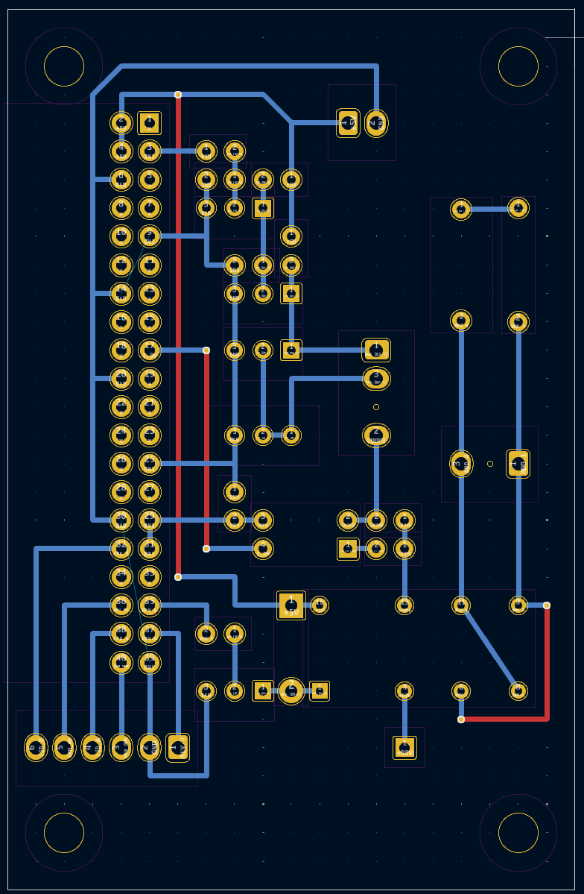

# Platine für piTelex TW39


## Die Funktionsmerkmale
Die hier beschriebene Platine eignet sich zum Anschluss eines Fernschreibers mit vorgeschaltetem Fernschaltgerät für das Wählverfahren TW39.

Die nötige Stromversorgung (+5V= und ca 80V= für die Linienversorgung)  muss extern bereitgestellt werden. Ein passender Bauvorschlag, der auch die Powersave-Funktion unterstützt, findet sich im [entsprechenden Unterverzeichnis](https://github.com/rwobrecht/piTelex-contrib/blob/main/TW39/V1/Stromversorgung-für-TW39-mit-Powersave) des repositories.

Die Platine/Schaltung verwendet drei LEDs:
* LED_Z blinkt bei Standby der Software ("ZZ"-Zustand) und leuchtet kontinuierlich bei Betriebsbereitschaft ("Z"-Zustand). Der Blinkrhythmus kann in `telex.json` mit `LED_Z_heartbeat` eingestellt werden (s.u.).
* LED_WB leuchtet bei Wählbereitschaft
* LED_A leuchtet bei bestehender i-telex-Verbindung

Es ist möglich, eine Stromsparschaltung zu aktivieren. Dazu muss die Stromversorgung aus dem [Bauvorschlag](https://github.com/rwobrecht/piTelex-contrib/blob/main/TW39/V1/Stromversorgung-für-TW39-mit-Powersave) verwendet werden. Der Pin `RP` (Relais Power)  dieser Platine wird dann mit dem Pin `RP` der Stromversorgung verbunden und steuert das Leistungsrelais auf der Stromversorgungsplatine, an deren Kontaktblock die (schutzgeerdete!) Steckdose zur Versorgung des Fernschaltgeräts und des Fernschreibers angeklemmt wird. Außerdem muss in der telex.json die Stromsparschaltung aktiviert werden. Der `telex.json`-Ausschnitt weiter unten enthält alle hierfür nötigen Einstellungen. Ist die Stromsparschaltung aktiv, dann gilt:

* Bei ankommendem Anruf schaltet piTelex die Stromversorgung für FSG/FS ein und nach Verbindungsende automatisch auch wieder aus.
* Für einen ausgehenden Anruf drückt man kurz die am `pin_button_PT` angeschlossene Taste, um das Stromrelais einzuschalten. Nach Verbindungsende wird die Anlage durch erneutes Drücken der Taste oder automatisch nach einer vorwählbaren Zeit (`power_button_timeout`) wieder ausgeschaltet.

Zusätzlich kann durch Aktivieren von `txd_powersave` im Standby auch der Schleifenstrom abgeschaltet werden. Das ist nützlich bei T68-Maschinen, die bei abgeschalteter Netzspannung den Linienstrom von 5mA auf 40mA hochfahren.

## Die Schaltung


Die Empfängerschaltung und die Polwechselschaltung sind unverändert aus dem piTelex-Wiki übernommen, die Schaltung des Senders besteht wie im Original aus einer Stromquellenschaltung mit BC337 und TIP50, verwendet aber statt der ULN...-Treiber-ICs für die Invertierung und Ankopplung des TXD-Signals zwei einfache NPN-Transistoren BC337. Mit dem Trimmpoti wird der Schleifenstrom auf 40mA eingestellt. Da wir es hier mit einer einstellbaren Konstantstromquelle zu tun haben, ist die Stromschleife kurzschlussfest und die Einstellung der 40mA kann daher auch bei Kurzschluss der Schleife erfolgen.

Diese Schaltung funktioniert in meinen sechs piTelex-TW39-Stationen seit Jahren problemlos...

## Die Platine

  


---

Sie ist nicht auf Kompaktheit optimiert; das Layout ist auf Einfachheit getrimmt. Die Leitungsführung ist bewusst in Standardrastermaß von 1/10 Zoll gehalten, so dass das Layout unverändert auch auf einer handelsüblichen Punktrasterplatine ganz "zu Fuß" umgesetzt werden kann.
Man kann sie zweilagig herstellen, aber auch als einlagige, unterseitig kupferkaschierte Platine ausführen, dann müssen lediglich drei Drahtbrücken auf Bauteilseite eingesetzt werden (im Bild rot), die ansonsten durch die zweite (obere) Kupferlage realisiert werden.  
Besonderes Augenmerk habe ich auf ausreichende Leiterbahnabstände im Hochspannnungsbereich gelegt. Wenn man die Schaltung auf einer Punktrasterplatine aufbaut, müssen die nicht verwendeten Lötstützpunkte im Bereich der Linienstromversorgung weggefräst werden, denn die 0,4mm "Luft" zwischen zwei Lötstützpunkten sind bei 120V Speisespannung sicher nicht ausreichend.

Als SBC ist ein Raspberry Pi Zero WH vorgesehen, der einfach seitlich auf die zweireihige Kontaktleiste gesteckt wird. Es passen natürlich auch andere RPi mit 40-poligem GPIO-Sockel.
Für die Steuerung eines einzelnen TW39-Fernschreibers ist ein  RPi Zero jedenfalls mehr als ausreichend.

Auf den Ersatz des Umpolrelais durch eine H-Bridge habe ich verzichtet. Die Standard-Relais arbeiten zuverlässig, sind preiswert und erfüllen ihren Zweck.


Der Leistungstransistor TIP50 wird abgesetzt über den Anschluss Q5 an geeigneter Stelle im Gehäuse mit Kühlkörper montiert. Es ist nicht vorgesehen, ihn direkt auf der Platine zu montieren. 
Achtung, die Pinfolge auf der Platine entspricht wegen der Leiterabstände und dem simplen Layout  **nicht** der [Pinfolge am Transistor](https://www.componentsinfo.com/wp-content/uploads/2022/10/tip50-transistor-pinout-equivalent.gif)

Der Kühlkörper muss etwa 4W abgeben können bei zulässiger Temperaturerhöhung. 
Ein solcher Alu-Fingerkühlkörper 36x36mm  bspw. tut hier gute Dienste.

### Bauteileliste

|Bauteil|Wert|
|-|-|
C1|100n Umax >= 250V|
D1|1N4007|
J1|PinSocket_2x20_P2.54mm_Horizontal|
J2-J5|PinHeader,z.B. Molex_KK-254 o.ä.|
K1|Relais DPDT, z.B. Axicom D2n oder Omron_G5V-2 o.ä|
Q4,Q3,Q2,Q1|BC337|
Q5|TIP50|
R11,R3,R1|1kOhm|
R2|470 Ohm|
R4|510 Ohm|
R6|100 Ohm|
R7,R5|330 Ohm|
R8,R9|68 Ohm|
RV1|20 Ohm Mehrgang|
U1|LTV-817 o.ä.|

Alle Widerstände 0,125 W oder 0,25W

### Anschlüsse

Die Platine bietet folgende Anschlussmöglichkeiten:

|Stecker|Pin|Name|Ein-/Ausgang|Beschreibung|
|-------|---|----|------------|---------------------------|
|J3     |1  |+90V|E           |Linienspannungseingang (+) |
||||||
|J4     |1  |+5V |E           |+5V Versorgungsspannung    |
|J4     |2  |GND |E           | Massepotential für +5V und +90V|
||||||
|J5     |1  |    |A           |Linienstrom für TW39 (+) (ADo8 Pin 1; [Pins2 und 3 in der Dose brücken!])|
|J5     |2  |    |A           |Linienstrom für TW39 (-) (ADo8 Pin 4)<br>Der Linienstrom von 40mA wird mit RV1 eingestellt, z.B. bei kurzgeschlossenen Pins von J5|
||||||
|J2     |1   |RP  |A           |`pin_power` herausgeführt. Schaltet das Leistungsrelais für die Netzspannungsversorgung zum Fernschreiber:<br>- manuell bei Drücken der Powertaste<br>- und bei ankommenden Verbindungen. <br>Das Relais befindet sich auf der Stromversorgungsplatine.|
|J2     |2   |GND |A           |Massepotential für LED und Taster|
|J2     |3   |BP  |E           |`pin_button_PT` herausgeführt.<br> Taster (gegen GND) schaltet den Fernschreiber über das Leistungsrelais auf der Stromversorgungsplatine ein und aus.|
|J2     |4   |LA  |A           |`pin_LED_A` herausgeführt. <br>Hier kann eine LED mit passendem Vorwiderstand (330 Ohm) gegen GND angeschlossen werden. <br>Sie leuchtet bei bestehender Verbindung.|
|J2     |5   |LW  |A           |`pin_LED_WB` herausgeführt.<br> Hier kann eine LED mit passendem Vorwiderstand (330 Ohm) gegen GND angeschlossen werden. <br>Sie leuchtet bei Wählbereitschaft.|
|J2     |6   |LZ  |A           |`pin_LED_Z` herausgeführt.<br> Hier kann eine LED mit passendem Vorwiderstand (330 Ohm) gegen GND angeschlossen werden. <br>Sie leuchtet im Offline-Modus. Zusammen mit der heartbeat-Funktion blinkt sie im Sleep-Modus langsam|

Die Pins in J2 können (bis auf den Massepin) natürlich auch anders oder auch gar nicht verwendet werden. Dann ist die `telex.json` (s.u.) entsprechend anzupassen.

## Die `telex.json`

Die Schaltung verwendet **nicht** die Standard-GPIOs von piTelex, daher füge ich einen passenden Ausschnitt aus der `telex.json` Datei mit den korrekten GPIO-Nummern bei:

```JSON
      "RPiTTY": {
      "type": "RPiTTY",         # standard TW39 (current loop) CCU and teletype
      "enable": true,
      "mode": "TW39",
      "pin_txd": 2,
      "pin_rxd": 5,
      "pin_relay": 19,          # GPIO of loop relay (for changing polarity)
      "pin_number_switch": -1,  # -1 = use definition in "RPiCtrl"
      "txd_powersave": true     # switch off loop current in sleep mode
    },
    "RPiCtrl": {
      "type": "RPiCtrl",
      "enable": true,
      "pin_number_switch": 6,   # GPIO of pin to monitor for dial pulses
      "pin_button_PT": 21,      # GPIO for power pushbutton (power save feature, toggles pin_power, see below)
      "pin_LED_WB": 16,         # GPIO for LED indicating dial mode (Wählbereitschaft)
      "pin_LED_A": 20,          # GPIO for LED indicating active connection
      "pin_LED_Z": 12,          # GPIO for LED indicating Standby/Sleep
      "LED_Z_heartbeat": 2,     # duty cycle of hearbeat in ZZ mode: 0.5s on / 1s off
      "pin_power": 26,          # GPIO for power relay (switching mains in power save feature)
      "inv_power": false
    },
(...)
# if you want to use the power saving feature:
  "power_off_delay": 3,         # wait 3 seconds after poweroff condition 
                                # before switching off mains
#
  "power_button_timeout": 7200, # if switched on by power button,
                                # switch off mains after 2 hours of inactivity 
                                # (probably forgot to switch off manually...)
```


## Abschließend der unvermeidliche Disclaimer:
Auch wenn dieser Schaltungsvorschlag in mehreren Exemplaren seit Jahren unproblematisch funktioniert: für korrekte Funktion und für mögliche Schäden, verursacht durch Verwendung der in diesem Repository bereitgestellten Informationen, kann ich keine Haftung übernehmen. 

Für die Einhaltung der sicherheitstechnischen Vorschriften und anerkannten Regeln der Technik, insbesondere im Bereich der elektrischen Sicherheit, ist jeder Anwender selbst verantwortlich.

Unabhängig davon würde ich mich über Rückmeldungen zu Funktion oder möglichen Verbesserungen sehr freuen.
