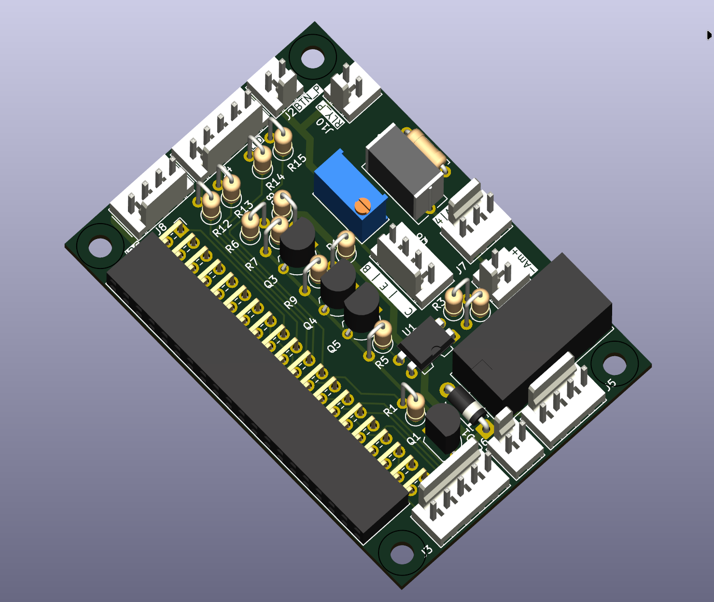
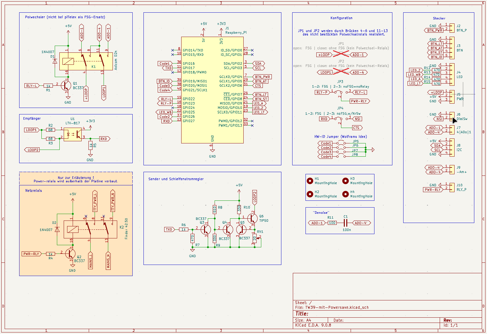
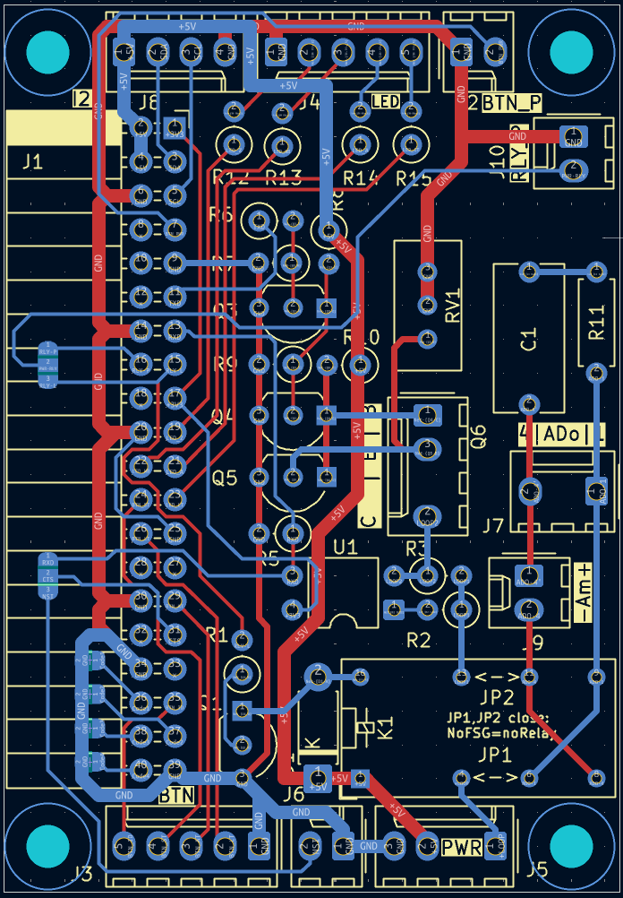

# Platine für piTelex TW39 (Version 4 - Allround)



## Die Funktionsmerkmale
Die hier beschriebene Platine eignet sich zum Anschluss eines Linienstrom-Fernschreibers

* **mit** vorgeschaltetem FSG
* **ohne** FSG; piTelex ersetzt die Funktionen des FSG

Durch Jumper kann die Verwendung mit bzw. ohne FSG konfiguriert werden, je nach Einsatz sind bestimmte Bauteile nicht zu bestücken bzw zwingend zu bestücken.

Die nötige Stromversorgung (+5V= und ca 80V= für die Linienversorgung)  muss extern bereitgestellt werden. Ein passender Bauvorschlag, der auch die Powersave-Funktion unterstützt, findet sich im [entsprechenden Unterverzeichnis](https://github.com/rwobrecht/piTelex-contrib/blob/main/TW39/V4/Stromversorgung-für-TW39-mit-Powersave) des repositories.

### LEDs

Die Platine/Schaltung verwendet drei bzw. vier LEDs (J4):
* LED_Z blinkt bei Standby der Software ("ZZ"-Zustand) und leuchtet kontinuierlich bei Betriebsbereitschaft ("Z"-Zustand). Der Blinkrhythmus kann in `telex.json` mit `LED_Z_heartbeat` eingestellt werden (s.u.).
* LED_WB leuchtet bei Wählbereitschaft
* LED_A leuchtet bei bestehender i-telex-Verbindung
* LED_LT leuchtet bei Lokalbetrieb (Nur bei Betrieb ohne FSG,  also piTelex als FSG-Ersatz)


### Taster

Bei Betrieb mit FSG kommt die Schaltung ganz ohne Taster aus. 
Nur bei Verwendung der Stromsparschaltung wird eine Ein-/Ausschalttaste zwischen `BTN_P` und GND benötigt (J2).

Bei Betrieb ohne FSG werden die Taster AT, LT und ST benötigt (J3). Die Ein-/Ausschalttaste entfällt.


### Stromsparschaltung

#### Funktion

Es ist möglich, eine [Stromsparschaltung](https://github.com/fablab-wue/piTelex/wiki/SW_MainsPower) zu aktivieren. Ist die Stromsparschaltung aktiv, dann gilt:

* Bei **ankommendem Anruf** schaltet piTelex die Stromversorgung für FSG/FS ein und nach Verbindungsende automatisch auch wieder aus.
* Für einen **ausgehenden Anruf** drückt man 
  * bei Betrieb **mit FSG** die am `pin_button_PT` angeschlossene Taste, um das Stromrelais einzuschalten. <br>Nach Verbindungsende wird die Anlage durch erneutes Drücken der Taste oder automatisch nach einer vorwählbaren Zeit (`power_button_timeout`) wieder ausgeschaltet.
  * bei Betrieb **ohne FSG** die Anruftaste (`pin_button_AT`). <br>Durch Drücken der ST-Taste (`pin_button_ST`) wird der Fernschreiber wieder ausgeschaltet.
* Bei Betrieb **ohne FSG** kann in den **Lokalmodus** geschaltet werden durch Drücken der Lokaltaste (`pin_button_LT`). <br>Ausschalten ebenfalls mit ST-Taste.

#### Realisierung

Dazu kann die Stromversorgung aus dem [Bauvorschlag](https://github.com/rwobrecht/piTelex-contrib/blob/main/TW39/V3/Stromversorgung-für-TW39-mit-Powersave) verwendet werden. Der Pin `RLY_P` (J10Pin2)  dieser Platine wird dann mit dem Pin `RP` der Stromversorgung verbunden und steuert das Leistungsrelais auf der Stromversorgungsplatine, an deren Kontaktblock die (schutzgeerdete!) Steckdose zur Versorgung des Fernschaltgeräts und des Fernschreibers angeklemmt wird. Außerdem muss in der telex.json die Stromsparschaltung aktiviert werden. Der `telex.json`-Ausschnitt weiter unten enthält alle hierfür nötigen Einstellungen.

Alternativ kann auch eine [kompatible WLAN-Schaltsteckdose](https://github.com/fablab-wue/piTelex/wiki/SW_MainsPower#software-solution) angesteuert werden. 

Zusätzlich kann durch Aktivieren von `"txd_powersave": true` auch der Schleifenstrom im Standby abgeschaltet werden. Das ist nützlich bei T68-Maschinen, die bei abgeschalteter Netzspannung den Linienstrom von 5mA auf 40mA hochfahren.


## Die Schaltung



Die Empfängerschaltung und die Polwechselschaltung sind unverändert aus dem piTelex-Wiki übernommen, die Schaltung des Senders besteht wie im Original aus einer Stromquellenschaltung mit BC337 und TIP50, verwendet aber statt der ULN...-Treiber-ICs für die Invertierung und Ankopplung des TXD-Signals zwei einfache NPN-Transistoren BC337. Mit dem Trimmpoti wird der Schleifenstrom auf 40mA eingestellt. 


---

## Die Platine



Besonderes Augenmerk habe ich auf ausreichende Leiterbahnabstände im Hochspannnungsbereich gelegt. Als SBC ist ein Raspberry Pi Zero WH vorgesehen, der einfach seitlich auf die zweireihige Kontaktleiste gesteckt wird. Es passen natürlich auch andere RPi mit 40-poligem GPIO-Sockel.
Für die Steuerung eines einzelnen TW39-Fernschreibers ist ein  RPi Zero jedenfalls mehr als ausreichend.

Auf den Ersatz des Umpolrelais durch eine H-Bridge habe ich verzichtet. Die Standard-Relais arbeiten zuverlässig, sind preiswert und erfüllen ihren Zweck.


Der Leistungstransistor TIP50 wird abgesetzt über den Anschluss Q5 an geeigneter Stelle im Gehäuse mit Kühlkörper montiert. Es ist nicht vorgesehen, ihn direkt auf der Platine zu montieren. 
**-->** Achtung, die Pinfolge auf der Platine entspricht wegen der Leiterabstände **nicht** der [Pinfolge am Transistor](https://www.componentsinfo.com/wp-content/uploads/2022/10/tip50-transistor-pinout-equivalent.gif) !

Bei Betrieb mit FSG, also voller Linienspannung, muss der Kühlkörper etwa 4W abgeben können bei zulässiger Temperaturerhöhung. Ein solcher Alu-Fingerkühlkörper 36x36mm  bspw. tut hier gute Dienste.

Bei Betrieb ohne FSG kann die Linienspannung auf Werte >=24V reduziert werden. Die vom Leistungstransistor maximal abzugebende Verlustleistung reduziert sich dadurch erheblich.

<br>

---

### Die Bauteileliste

| Bauteil | Bezeichnung | Bestücken<br>mit FSG | Bestücken<br>Ohne FSG | Bemerkung |
| ------- | ----------- | -------------------- | --------------------- | --------- |
| R1    | 1k              | JA | NEIN |                                            |
| R2            | 68            | JA | JA |                                            |
| R3         | 68           | JA | JA |                                            |
| R4            | 1k         | --- | --- | ird ggf. auf der Stromversorgungsplatine bestückt |
| R5         | 1k          | JA | JA |                                            |
| R6 | 1k            | JA | JA |                                            |
| R7 | 470 | JA | JA | |
| R8 | 510 | JA | JA | |
| R9 | 330 | JA | JA | |
| R10 | 330 | JA | JA | |
| R11 | 100 | JA | JA | |
| R12-R15 | 470 | JA | JA | für LEDs |
| RV1            | 20 Ohm              | JA | JA | Mehrgang-Poti z.B. Bourns_3296W_Vertical<br>Der Linienstrom von 40mA wird mit RV1 eingestellt |
| C1             | 100nF               | JA | JA | C_Rect_L11.0mm_W5.1mm_P10.00mm_MKT         |
| D1             | 1N4007              | JA | NEIN |                                            |
| D2 | --- | --- | --- | Wird ggf. auf der Stromversorgungsplatine bestückt |
| Q1 | BC337 | JA | NEIN | |
| Q2 | --- | --- | --- | Wird ggf. auf der Stromversorgungsplatine bestückt |
| Q3,Q4,Q5 | BC337               | JA | JA |                                            |
| Q6            | TIP50               | JA | JA | PinHeader 1x4, z.B. Molex_KK-254           |
| U1       | LTV-817             | JA | JA | Optokoppler LTV-817 o.ä.                   |
| K1 | Miniaturrelais DPDT | JA | NEIN | z.B. Omron_G5V-2 oder Axicom D2n |
| K2 | Leistungsrelais | --- | --- | Wird ggf. auf der Stromversorgungsplatine bestückt |
| J1             | Raspberry_Pi_ZeroWH | JA | JA | PinSocket_2x20_P2.54mm_Horizontal          |
| J2             | BTN_P           | JA                   | JA | PinHeader 1x02 vertical, z.B. Molex_KK-254 |
| J3             | BTN               | NEIN | JA | PinHeader 1x05 vertical, z.B. Molex_KK-254 |
| J4             | LED              | JA | JA | PinHeader 1x05 vertical, z.B. Molex_KK-254 |
| J5             | PWR          | JA | JA | PinHeader 1x03 vertical, z.B. Molex_KK-254 |
| J6             | DialSW         | JA                   | JA | PinHeader 1x02 vertical (optional)         |
| J7       | 4\|ADo\|1           | JA                   | JA                    | PinHeader 1x03 vertical, z.B. Molex_KK-254 |
| J8       | I2C                 | JA                | JA                  | PinHeader 1x04 vertical, z.B. Molex_KK-254 |
| J9       | Am                  | JA                | JA                  | PinHeader 1x02 vertical, z.B. Molex_KK-254 |
| J10      | RLY_P             | JA                   | JA                    | PinHeader 1x02 vertical, z.B. Molex_KK-254 |

Alle Widerstände 0,125 W oder 0,25W


### Die Anschlüsse

Die Platine bietet folgende Anschlussmöglichkeiten:

|Stecker|Pin|Name|Ein-/Ausgang|Beschreibung|
|-------|---|----|------------|---------------------------|
|J2|1|GND|E||
|J2     |2   |BP  |E           |`pin_button_PT` herausgeführt.<br>Taster (gegen GND) schaltet den Fernschreiber über das Leistungsrelais auf der Stromversorgungsplatine ein und aus.|
| --- | | | ||
| J3 | 1 | GND | E |Massepotential für Taster|
| J3 | 2 | BTN_LT | E |(Nur bei Betrieb ohne FSG): Taster gegen GND schaltet Lokalbetrieb ein|
| J3 | 3 | BTN_AT | E |(Nur bei Betrieb ohne FSG): Taster gegen GND als AT-Taste|
| J3 | 4 | BTN_ST | E |(Nur bei Betrieb ohne FSG): Taster gegen GND als ST-Taste|
| J3 | 5 | BTN_ID | E |(Nur bei Betrieb ohne FSG): Taster gegen GND zur Auslösung des KG (optional)|
|---|||||
|J4     |1   |GND |A           |Massepotential für LED|
|J4     |2   |LZ  |A           |`pin_LED_Z` herausgeführt. Hier kann eine LED gegen GND angeschlossen werden. <br>Sie leuchtet im Offline-Modus. Zusammen mit der heartbeat-Funktion blinkt sie im Sleep-Modus langsam|
|J4     |3   |LW  |A           |`pin_LED_WB` herausgeführt. Hier kann eine LED gegen GND angeschlossen werden. <br>Sie leuchtet bei Wählbereitschaft.|
|J4     |4   |LA  |A           |`pin_LED_A` herausgeführt. Hier kann eine LED gegen GND angeschlossen werden. <br>Sie leuchtet bei bestehender Verbindung.|
|J4 |5 |LLT |A |`pin_LED_LT` herausgeführt. Hier kann eine LED gegen GND angeschlossen werden. <br/>Sie leuchtet bei Lokalbetrieb **(nur für Betrieb ohne FSG)**.|
|---|||||
|J5     |1  |+80V|E           |Linienspannungseingang (+) |
| J5      | 2    | ---   | ---          | (blind)                                                      |
|J5     |3  |+5V |E           |+5V Versorgungsspannung    |
|J5 |4 |GND |E |Massepotential für +5V und +80V |
| --- | | | | |
| J6 | 1 | GND | E | Massepotential für Nummernschalter |
| J6 | 2 | DialSw | E | falls separater Nummernschalter verwendet wird gegen GND |
| ___ | | | | |
| J7 | 1 | ADo1 | A | zu Pin 1 der FS-Anschlussdose |
| J7 | 2 | --- | --- | (blind)  (Brücke Pin2-Pin3 und Pin5-Pin6 in der Dose nicht vergessen) |
| J7 | 3 | ADo4 | A | zu Pin 4 der FS-Anschlussdose |
| --- |  |  |  |  |
|J8|1|+5V||I2C|
|J8     |2  |SDA |            | I2C|
|J8     |3  |SCL |            | I2C|
|J8 |4 |GND | | I2C |
|---|||||
|J9|1|ADo4'||Zum (+)  Anschluss Linienstrom-Amperemeter, ansonsten BRÜCKEN mit JP9 Pin2!|
|J9|2|ADo4||Zum (-)  Anschluss Linienstrom-Amperemeter, ansonsten BRÜCKEN mit JP9 Pin1!|
|---|||||
|J10 |1 |GND |A | Massepotential für RLY_P |
|J10     |2   |RLY_P  |A           |`pin_power` herausgeführt. Schaltet das Leistungsrelais für die Netzspannungsversorgung zum Fernschreiber:<br>- manuell bei Drücken der Powertaste<br>- und bei ankommenden Verbindungen. <br>Das Relais befindet sich auf der Stromversorgungsplatine.|
|---|||||

---

### Die Jumper

Mit den Jumpern kann die Platine konfiguriert werden.

| Jumper | Betrieb<br>mit FSG | Betrieb<br>ohne FSG | Bemerkung                                                    |
| ------ | ------------------ | ------------------- | ------------------------------------------------------------ |
| JP1    | ---                | gebrückt            | D1,K1,R1,Q1 nicht bestücken bei Betrieb ohne FSG             |
| JP2    | ---                | gebrückt            | D1,K1,R1,Q1 nicht bestücken bei Betrieb ohne FSG             |
| JP3    | Brücke 1-2         | Brücke 2-3          |                                                              |
| JP4    | Brücke 1-2         | Brücke 2-3          | separater NrS bei Betrieb ohne FSG                           |
| JP5-8  |                    |                     | frei, kann softwareseitig frei verwendet werden für Zusatzfunktionen |


## Die `telex.json`

### Betrieb mit FSG und mit Powersave

```JSON
{
  "devices": {
    "screen": {
      "type": "screen",
      "enable": true
    },
    "RPiTTY": {
      "type": "RPiTTY",          # standard TW39 (current loop) CCU and teletype
      "enable": true,
      "mode": "TW39",
      "pin_txd": 17,
      "pin_rxd": 27,
      "pin_relay": 22,           # GPIO of loop relay (for changing polarity)
      "pin_number_switch": -1,   # -1 = use definition in "RPiCtrl"
      "loopback": true,
      "use_observe_line" : true,
      "pin_observe_line": 6,
      "inv_observe_line" : false,
      "txd_powersave": true     # switch off loop current in sleep mode
    },
    "RPiCtrl": {
      "type": "RPiCtrl",
      "enable": true,
      "pin_number_switch": 6,   # GPIO of pin to monitor for dial pulses
      "pin_button_PT": 4,       # GPIO for power pushbutton (power save feature, toggles pin_power, see below)
      "pin_LED_WB": 25,         # GPIO for LED indicating dial mode (Wählbereitschaft)
      "pin_LED_A": 9,           # GPIO for LED indicating active connection
      "pin_LED_Z": 10,          # GPIO for LED indicating Standby/Sleep
      "LED_Z_heartbeat": 2,     # duty cycle of hearbeat in ZZ mode: 0.5s on / 1s off
      "pin_power": 23,          # GPIO for power relay (switching mains in power save feature)
      "inv_power": false
    },
# Zum Schalten einer WLAN Steckdose:
    "shellcmd": {
      "type": "shellcmd",
      "enable": true,
      "LUT": {
        "TP1": "curl -s -o /dev/null http://socket.fritz.box/cm?cmnd=Power%20On", # Anpassen!
        "TP0": "curl -s -o /dev/null http://socket.fritz.box/cm?cmnd=Power%20Off" # Anpassen!
      }
    }
  },
# if you want to use the power saving feature:
  "power_off_delay": 5,                # Verzögerung für das Abschalten der Netzspannung nach Drücken der ST-Taste   
  "power_button_timeout": 7200,        # Nach 7200s Inaktivität wird die Maschine abgeschaltet


  "wru_id": "123456 dummy d",          # Software-Kennung, anpassen!
  "dial_timeout": 0,                   # Standard-Wahlverfahren
  "continue_with_no_printer": false    # Ohne funktionierenden Drucker keine Verbindung annehmen
}
```

### Betrieb ohne FSG 

```json
{
  "devices": {
    "screen": {
      "type": "screen",
      "enable": true
    },
    "RPiTTY": {
      "type": "RPiTTY",               # standard TW39 (current loop) CCU and teletype
      "enable": true,
      "mode": "TW39",
      "pin_txd": 17,
      "pin_rxd": 27,
      "pin_relay": 22,                # GPIO of loop relay (for changing polarity)
      "pin_number_switch": -1,        # -1 = use definition in "RPiCtrl"
      "loopback": true,
      "use_observe_line" : true,
      "pin_observe_line": 6,
      "inv_observe_line" : false,
      "txd_powersave": true           # switch off loop current in sleep mode
    },
    "RPiCtrl": {
      "type": "RPiCtrl",
      "enable": true,
      "pin_number_switch": 6,         # 0 für Tastaturwahl
      "inv_number_switch": false,
      "pin_button_AT": 5,             # AT-Taste 
      "pin_button_ST": 8,             # ST-Taste
      "pin_button_LT": 7,             # LT-Taste
      "pin_button_U3": 19,            # U3 standardmäßig vorbelegt mit "#" d.i. die eigene Kennung
      "pin_LED_WB": 25,               # LED für Wählbereitschaft
      "pin_LED_A": 9,                 # LED für aktive Verbindung
      "pin_LED_Z": 10,                # LED für Ruhemodus
      "LED_Z_heartbeat": 3,           # Tastverhältnis off/on = 3:1 im Sleep-Modus
      "delay_AT": 0.5,                # Gimmick: Zeitverzögerung in s simuliert Elektromechanik :-)
      "delay_ST": 2
    },
    "i-Telex": {
      "type": "i-Telex",
      "enable": true,
      "port": 2342,
      "tns_dynip_number": 0,          # Anpassen, siehe wiki!
      "tns_pin": 12345                # Anpassen, siehe wiki!
    },
 # FZum Schalten einer WLAN Steckdose:
    "shellcmd": {
      "type": "shellcmd",
      "enable": true,
      "LUT": {
        "A": "curl -s -o /dev/null http://socket.fritz.box/cm?cmnd=Power%20On", # Anpassen!
        "Z": "curl -s -o /dev/null http://socket.fritz.box/cm?cmnd=Power%20Off" # Anpassen!
      }
    }
  },
# if you want to use the power saving feature:
  "power_off_delay": 5,                # Verzögerung für das Abschalten der Netzspannung nach Drücken der ST-Taste   
  "power_button_timeout": 7200,        # Nach 7200s Inaktivität wird die Maschine abgeschaltet
 
  "wru_id": "123456 dummy d",          # Software-Kennung, Anpassen!
  "dial_timeout": 0,                   # Standard-Wahlverfahren
  "continue_with_no_printer": false    # Ohne funktionierenden Drucker keine Verbindung annehmen
}

```


## Abschließend der unvermeidliche Disclaimer:

Für korrekte Funktion und für mögliche Schäden, verursacht durch Verwendung der in diesem Repository bereitgestellten Informationen, kann ich keine Haftung übernehmen. 

Für die Einhaltung der sicherheitstechnischen Vorschriften und anerkannten Regeln der Technik, insbesondere im Bereich der elektrischen Sicherheit, ist jeder Anwender selbst verantwortlich.

Unabhängig davon würde ich mich über Rückmeldungen zu Funktion oder möglichen Verbesserungen, auch in der Dokumentation, sehr freuen.
