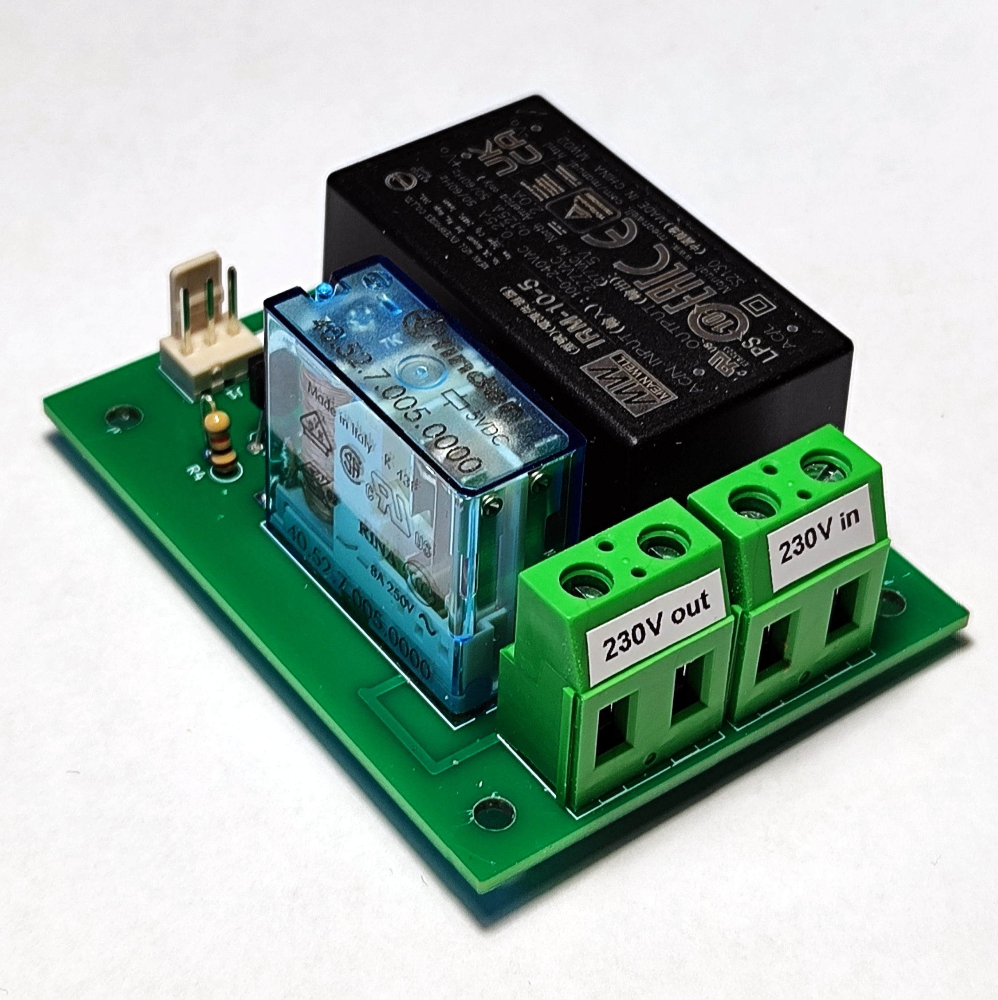
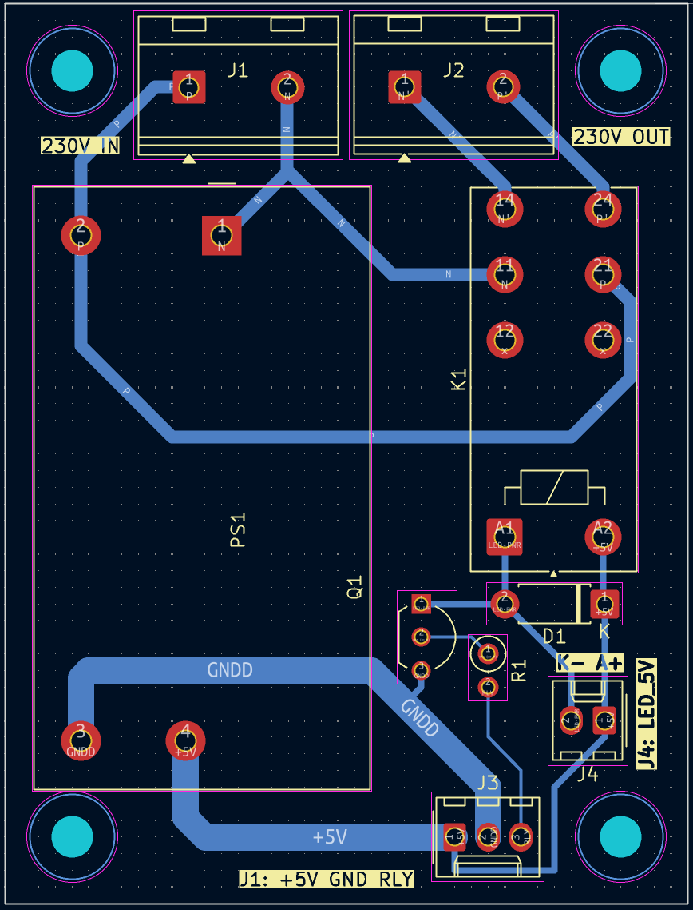

## Platine für piTelex V.10 (Stromversorgung)

## Die Funktion
Die hier beschriebene Platine liefert eine galvanisch vom Netz getrennte +5V Spannung bei max 2A für die Versorgung eines RPi Zero WH und der übrigen Steuerelektronik. Dafür ist ein fertiger Netzteilbaustein Meanwell IRM 10-5 verwendet. Der Baustein ist in Schutzklasse II ausgeführt und u.a. TÜV-zertifiziert:

Darüber hinaus gibt es einen relaisgeschalteten 230V-Ausgang zum Anschluss des Fernschreibers. Wird der Steuereingang mit dem entsprechenden Ausgang auf der V.10-Platine verbunden, kann damit eine Stromsparschaltung realisiert werden, so dass der FS220 nur Netzspannung erhält für die Dauer eines ankommenden Fernschreibens und bei manueller Betätigung des Tasters "PT" ([siehe V.10-Platine](https://github.com/rwobrecht/piTelex-contrib/tree/main/V.10-3-mit-Powersave) ).

---

## Die Platine

Die Platine wurde mit KiCad entwickelt, die Projektdaten liegen im [KiCad-Unterverzeichnis](KiCad).Man kann die Platine zweilagig herstellen, aber auch als einlagig kupferkaschierte Platine ausführen, dann muss lediglich eine Drahtbrücke eingesetzt werden, die ansonsten durch die zweite Kupferlage realisiert wird. 

Besonderes Augenmerk habe ich auf ausreichende Leiterbahnabstände im Netzspannnungsbereich gelegt. 
Die V.10-Platine wird über einen dreipoligen Stecker J1 versorgt, der auch den Eingangspin für die Relaissteuerung enthält.

### Die Stückliste

|Bez.|Bauteil|Bemerkung|
|----|-------|---------|
| J1|PinHeader 3pol RM2,54mm, z.B. Molex-KK254 o.ä.|
| J2,J3| Schraubklemme 2pol  RM 10,16|
|D4| 1N4007|
|K1|Relais DPDT 250V/8A, 5V Spule | z.B. FINDER-40.52|
|R1|1k 0,125W|
|Q2|BC337|
|PS1| MeanWell IRM 10-5|
||(Sorry für die krude Annotierung...)|

---

## Die Sicherheit
Der FS220 ist in Schutzklasse II ausgeführt, so dass die Durchverbindung des Schutzleiters auf die FS-Steckdose entbehrlich ist.  
Die Eingangsseite (230V) sollte mit 1A träge abgesichert werden. Das ist ausreichend für den Betrieb eines Fernschreibers FS220. Diese Sicherung ist nicht auf der Platine vorgesehen, sondern wird bei mir über eine im Gehäuse verbaute Kaltgeräte-Einbaubuchse mit integriertem Sicherungshalter realisiert. 

Das Ganze wird sinnvollerweise in ein Vollkunststoffgehäuse Schutzklasse II eingebaut. Von außen berührbare Metallteile (bspw. Metallfrontplatte o.ä) mit ausreichendem Leiterquerschnitt schutzerden! Dazu muss eine **drei**adrige Netzzuleitung **mit Schutzleiter (PE)** verwendet werden.

## Abschließend der unvermeidliche Disclaimer:
Auch wenn dieser Schaltungsvorschlag in mehreren Exemplaren seit Jahren unproblematisch funktioniert: für korrekte Funktion und für mögliche Schäden, verursacht durch Verwendung der in diesem Repository bereitgestellten Informationen, kann ich keine Haftung übernehmen. 

Für die Einhaltung der sicherheitstechnischen Vorschriften und anerkannten Regeln der Technik, insbesondere im Bereich der elektrischen Sicherheit, ist jeder Anwender selbst verantwortlich.

Unabhängig davon würde ich mich über Rückmeldungen zu Funktion oder möglichen Verbesserungen sehr freuen.
