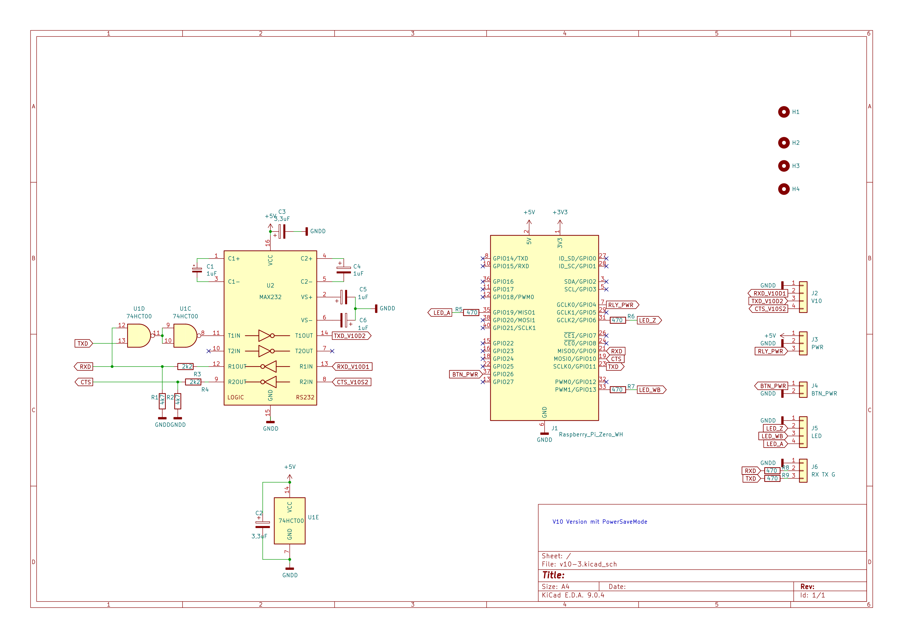
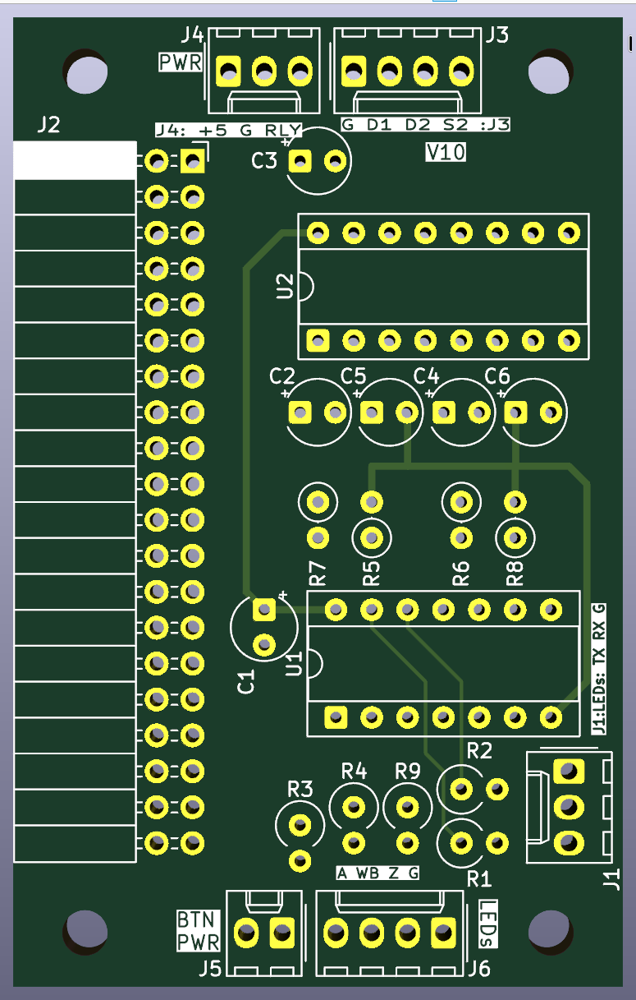
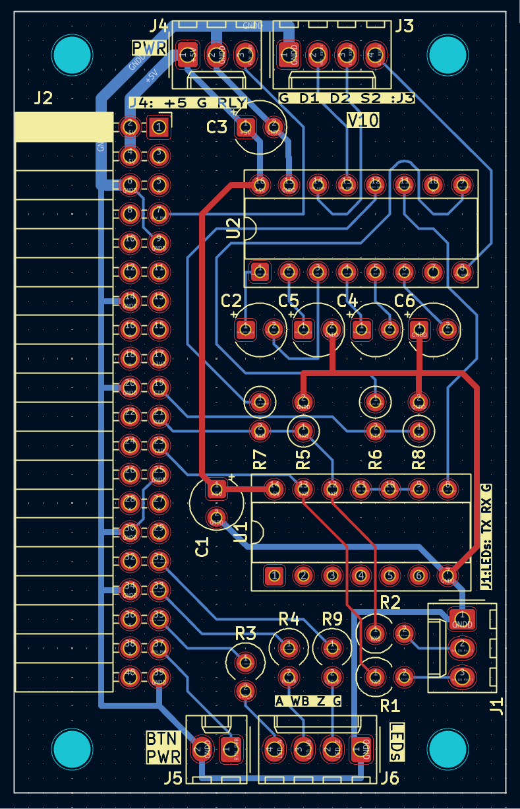

# Platine für piTelex V.10 (FS200/220)


## Die Funktionsmerkmale
Die hier beschriebene Platine eignet sich zum Anschluss eines Fernschreibers mit V.10 Schnittstelle (TeKaDe FS200/FS220) ***ohne*** Fernschaltgerät (FAG200 o.ä.). 

Die nötige Stromversorgung (+5V= ) muss extern bereitgestellt werden. Ein passender Bauvorschlag, der auch die Powersave-Funktion unterstützt, findet sich im [entsprechenden Unterverzeichnis](https://github.com/rwobrecht/piTelex-contrib/blob/main/V.10-3-Powersupply) des repositories.

Die Platine/Schaltung verwendet drei LEDs:
* LED_Z blinkt bei Standby der Software ("ZZ"-Zustand) und leuchtet kontinuierlich bei Betriebsbereitschaft ("Z"-Zustand). Der Blinkrhythmus kann in `telex.json` mit `LED_Z_heartbeat` eingestellt werden (s.u.).
* LED_WB leuchtet bei Wählbereitschaft
* LED_A leuchtet bei bestehender i-telex-Verbindung

Es ist möglich, eine Stromsparschaltung zu aktivieren. Dazu muss die Stromversorgung aus dem [Bauvorschlag](https://github.com/rwobrecht/piTelex-contrib/blob/main/V10-3-Powersupply) verwendet werden. Der Pin 3 des Steckers J3 dieser Platine steuert das Leistungsrelais auf der Stromversorgungsplatine, an deren Kontaktblock die (schutzgeerdete!) Steckdose zur Versorgung des Fernschaltgeräts und des Fernschreibers angeklemmt wird. Außerdem muss in der telex.json die Stromsparschaltung aktiviert werden. Der `telex.json`-Ausschnitt weiter unten enthält alle hierfür nötigen Einstellungen. Ist die Stromsparschaltung aktiv, dann gilt:

* Bei ankommendem Anruf schaltet piTelex die Stromversorgung für FSG/FS ein und nach Verbindungsende automatisch auch wieder aus.
* Für einen ausgehenden Anruf drückt man kurz die am `pin_button_PT` angeschlossene Taste, um das Stromrelais einzuschalten. Nach Verbindungsende wird die Anlage durch erneutes Drücken der Taste oder automatisch nach einer vorwählbaren Zeit (`power_button_timeout`) wieder ausgeschaltet.

---

## Die Schaltung



Für die Ansteuerung des Fernschreibers werden nur die Signale TXD,RXD und CTS benötigt. Damit die gesendeten Zeichen in rot, die empfangenen in schwarz gedruckt werden, ist mittels eines 74HCT00 Bausteins ein hardware-loopback realisiert. Die 74**HCT**xx-Serie ist für die 3,3V-Logik angepasst, andere Familien (LS,...) müssen nicht zwingend funktionieren. Die V.10-Schnittstelle ist sehr ähnlich zur V.24 bzw. RS232-Schnittstelle und arbeitet mit symmetrischen Spannungen. Daher kann zur Pegelumwandlung von TTL-Signalen ein MAX232 verwendet werden.
Um den TTL-Ausgangspegel des MAX232 auf 3,3V für den RPi herabzusetzen, werden zwei Spannungsteiler R7/R5 und R8/R6 eingesetzt.

Die Schaltung verwendet **nicht** die Standard-GPIO-Belegung! 


---
## Die Platine



Die Platine ist zweilagig mit KiCad entwickelt worden, die Projektdaten liegen im Unterverzeichnis [KiCad](KiCad).

Als SBC ist ein Raspberry Pi Zero WH vorgesehen, der einfach seitlich auf die zweireihige Kontaktleiste gesteckt wird. Es passen natürlich auch andere RPi mit 40-poligem GPIO-Sockel.
Für die Steuerung eines einzelnen V.10-Fernschreibers ist ein  RPi Zero jedenfalls mehr als ausreichend.


### Bauteileliste

Bauteil|Wert|
|-|-|
|C1,C3|3,3µF/16V|
|C2,C4,C5,C6| 1µF/16V|
|R1,R2,R3,R4,R9|470 Ohm|
|R5,R6|4K7|
|R7,R8|2k2|
|U1|74HCT00|
|U2|MAX232|

Alle Widerstände 0,125 W oder 0,25W

### Anschlüsse

Die Platine bietet folgende Anschlussmöglichkeiten:

|Stecker|Pin|Name|Ein-/Ausgang|Beschreibung|
|-------|---|----|------------|---------------------------|
|J1     |1  |GND |            ||
|J1     |2  |TXD |A           | TXD zur weiteren Verarbeitung (LED?)|
|J1     |3  |RXD |A           | RXD zur weiteren Verarbeitung (LED?)|
|||||
|J2     |*  |    |            | RaspBerryPi GPIO|
|||||
|J3     |1  |GND |A           ||
|J3     |2  |D1  |E           |verbinde auf Pin 2 der DSUB25 Buchse|
|J3     |3  |D2  |A           |verbinde auf Pin 3 der DSUB25 Buchse|
|J3     |4  |S2  |E           |verbinde auf Pin 4 der DSUB25 Buchse|
|||||
|J4     |1  |+5V |E           |+5V Versorgungsspannung    |
|J4     |2  |GND |E           | Massepotential für +5V |
|J4     |3  |RLY |A           | Steuerspannung Relais| 
|||||
|J5     |1  |    |A           |Taster Powersave|
|J5     |2  |    |E           |Taster Powersave|
|||||
|J6     |1  |GND| Rückleiter |
|J6     |2  | LED_Z|A        | Anode LED_Z ohne Vorwiderstand anschließen gegen J6/Pin1|
|J6     |3  | LED_WB|A       | Anode LED_WB ohne Vorwiderstand anschließen gegen J6/Pin1|
|J6     |2  | LED_A|A        | Anode LED_A ohne Vorwiderstand anschließen gegen J6/Pin1|

---

## Die DB25-Buchse zum FS200
Die Buchse braucht folgende Pinbelegung:

|Pin|Signal|von Stecker/Pin|
|-|-|-|
|2|D1|J3/2|
|3|D2|J3/3|
|4|S2|J3/4|
|7,9,11-14|GND|J3/1|

---

## Die `telex.json`

Die Schaltung verwendet **nicht** die Standard-GPIOs von piTelex, daher füge ich einen passenden Ausschnitt aus der `telex.json` Datei mit den korrekten GPIO-Nummern bei:

```JSON

    "RPiTTY_FS200": {
      "type": "RPiTTY",
      "enable": true,
      "mode": "V10",
      "pin_txd": 11,
      "pin_rxd": 9,
      "use_observe_line": true,
      "pin_observe_line": 10,
      "inv_observe_line": true,
      "nZZ_observe_line": true,
      "baudrate": 200,
      "coding": 0,
      "loopback": false
    },
    "RPiCtrl": {
      "type": "RPiCtrl",
      "enable": true,
      "pin_number_switch": 0,
      "pin_button_PT": 26,
      "pin_LED_A": 19,
      "pin_LED_WB": 13,
      "pin_LED_WB_A": 0,
      "pin_LED_Z": 6,
      "pin_power": 4,
      "inv_power": false
    },
    
(....)  
  
  },
  "wru_id": "123456 dummy d",
  "wru_replace_always": false,
  "continue_with_no_printer": false,
  "power_off_delay": 3,          # 3s nach Ende der Verbindung schaltet die Maschine ab
  "power_button_timeout": 7200,  # nach 2h Betrieb schaltet die Maschine immer ab
  "dial_timeout": "+"            # plus-dialing wie im EDS (nach Eingabe der Ziffern muss  "+" eingegeben werden zum Starten der Wahl )
}

```
---

## Abschließend der unvermeidliche Disclaimer:
Auch wenn dieser Schaltungsvorschlag in mehreren Exemplaren unproblematisch funktioniert: für korrekte Funktion und für mögliche Schäden, verursacht durch Verwendung der in diesem Repository bereitgestellten Informationen, kann ich keine Haftung übernehmen. 

Für die Einhaltung der sicherheitstechnischen Vorschriften und anerkannten Regeln der Technik, insbesondere im Bereich der elektrischen Sicherheit, ist jeder Anwender selbst verantwortlich.

Unabhängig davon würde ich mich über Rückmeldungen zu Funktion oder möglichen Verbesserungen sehr freuen.
