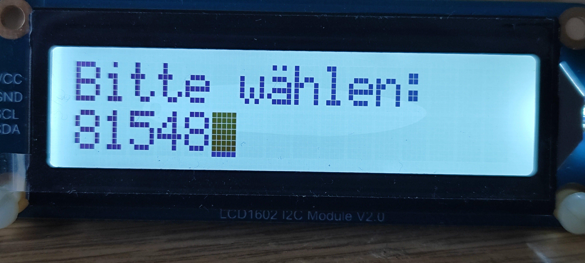
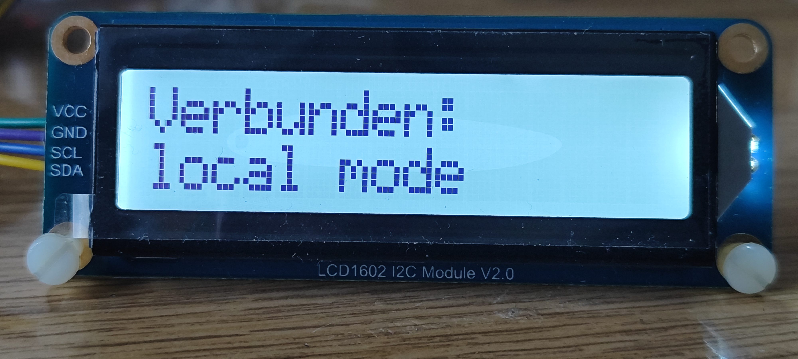
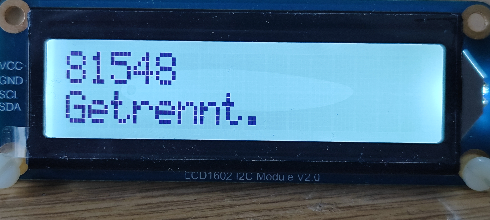
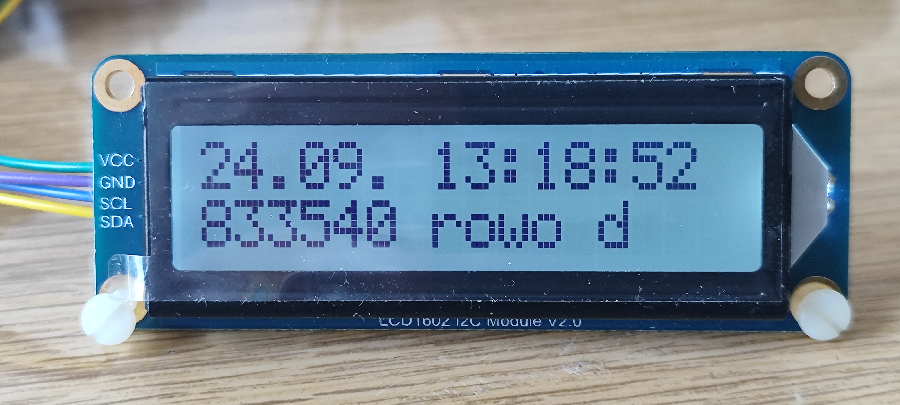

# txDevLCD1602.py

## piTelex-Modul zur Steuerung eines LCD-Displays

Dieses Modul erlaubt die Ansteuerung eines LCD-Displays mit zwei Zeilen zu 16 Zeichen über den I2C-Bus des RaspberryPi, sofern der Displaytreiberbaustein ein AiP31068 oder kompatibel ist. 


### Die Funktion

Wozu braucht piTelex ein LCD-Display? Die Statusrückmeldungen können ja auch über LEDs (entweder über PWM mit einer BiColor-LED `pin_LED_status_G`,`pin_LED_status_R`) oder mit dedizierten LEDs (`pin_LED_WB`, `pin_LED_A` ,`pin_LED_WBA` ,`pin_LED_Z`, `pin_LED_LT`) erfolgen.

Die Motivation  für eine alphanumerische Anzeige entstand durch die Verwendung eines Tastwahlblocks mit Kurzwahlspeicher. Da sieht man die gewählte Nummer nicht und muss hoffen, dass die Speicherbelegung des TWB so ist, wie man sich zu erinnern glaubt :-( 

Deshalb musste eine Anzeige zur Kontrolle der gewählten Nummer her. Und weil die 16x2-Displays so schön preiswert sind... da kann man dann auch gleich die Statusmeldungen mit anzeigen und auch noch im Bereitschaftsmodus Datum und Uhrzeit mitlaufen lassen. Im Prinzip kann dieses LC-Display die LEDs vollständig ersetzen, aber ich liebe das LED-Blinken eben auch.... Die Entscheidung muss jeder für sich treffen. Ich nutze beides parallel.

Hier ein paar Beispielbilder der Anzeige:

| <br>Wählbereitschaft      | <br>Aktive Verbindung (nach Wahl von '000' oder Drücken von 'LT') |
| ------------------------------------------------------------ | ------------------------------------------------------------ |
| <br>**Nach Verbindungsende** | <br>**Im Bereitschaftsmodus** |


### Die Hardware

Als Display habe ich das [Modul LCD1602 von Waveshare](https://www.waveshare.com/wiki/LCD1602_I2C_Module) verwendet. Es kann mit RPi-kompatiblen 3,3V ohne Einschränkung betrieben werden und erlaubt eine Einstellung der Displayhelligkeit über einen intergierten SN3193 Baustein. Standard-HD44780-Module mit PCF8574-Treiberbaustein für den I2C-Bus können mit diesem Modul nicht direkt betrieben werden, sie benötigen Anpassungen im Code; u.a. kann die Hintergrundbeleuchtung bei diesen Displays nur geschaltet werden, PWM zur Helligkeitseinstellung muss extern realisiert werden (bspw. über einen GPIO-Pin des RPi). 

<!--  -->

Das Modul wird mit den mitgelieferten Kabel an die I2C-Pins des RPi angeschlossen. Das sind

| I2C Signal | Wert  | GPIO-Pin (nicht GPIO-Nummer!) |
| ---------- | ----- | ----------------------------- |
| Vcc        | 3,3V  | 1 oder 17                     |
| GND        | 0V    | 6,9,25,39,14,20,30 oder 34    |
| SDA        | Data  | 3                             |
| SCL        | Clock | 5                             |


### Die Software

Um den I2C-Bus nutzen zu können, muss auf dem Raspi das entsprechende Paket installiert sein: `sudo apt install smbus`.

Außerdem muss in `sudo raspi-config`  der I2C-Bus enabled sein: `sudo raspi-config nonint do_i2c 0`.

Zur Sicherheit einmal neu booten...


### Anpassungen in piTelex

1. Das piTelex-Modul `txDevLCD1602.py` und die zugehörige Bibliothek `LCD1602.py` müssen ins piTelex-Verzeichnis kopiert werden.
2. In der `telex.py` muss das neue Modul eingetragen werden, damit es beim Start von piTelex erkannt werden kann. Dazu muss in der Initialisierungsroutine `init()` an geeigneter Stelle folgender Code ergänzt werden:

```python
	elif dev_param['type'] == 'LCD1602':
        import txDevLCD1602
        display = txDevLCD1602.TelexLCD1602(**dev_param)
        DEVICES.append(display)
```


### Die `telex.json`-Erweiterung

In der `telex.json` muss das Modul eingetragen und enabled sein. 

```json
"LCD1602":{
  "type": "LCD1602",
  "enable": true,
  # Optionale Anpassungen 
  "WB_text": "Bitte wählen:",				# Text im Status "Wählbereit" (WB); default: "Dialing"
  "WB_brightness": 50,                      # Displayhelligkeit in Prozent (0-100) im Status WB
  "Incoming_text": "Ankommender Ruf",		# Text bei ankommendem Ruf; default: "Incoming call"
  "A_text": "Verbunden:",					# Text im Status "Online" (A,AA); default: "Connected"
  "A_brightness": 20,                       # Displayhelligkeit in Prozent (0-100) im Status A,AA
  "Z_text": "Getrennt. ",					# Text im Status "Offline" (Z); default: "Disconnected"
  "Z_brightness": 20,                       # Displayhelligkeit in Prozent (0-100) im Status Z
  "ZZ_text": "833540 rowo d",				# Text im Status "Sleeping" (ZZ); default: "Standby"
  "ZZ_brightness": 1                        # Displayhelligkeit in Prozent (0-100) im Status ZZ
},	
```

---

## Abschließend der unvermeidliche Disclaimer:

Für korrekte Funktion und für mögliche Schäden, verursacht durch Verwendung der in diesem Repository bereitgestellten Informationen, kann ich keine Haftung übernehmen. 

Für die Einhaltung der sicherheitstechnischen Vorschriften und anerkannten Regeln der Technik, insbesondere im Bereich der elektrischen Sicherheit, ist jeder Anwender selbst verantwortlich.

Unabhängig davon würde ich mich über Rückmeldungen zu Funktion oder möglichen Verbesserungen sehr freuen.
